# Mermaid 常用语法说明文档

Mermaid 是一个基于 JavaScript 的图表和图形工具，可以通过文本和代码创建图表。

## 1. 流程图 (Flowchart)

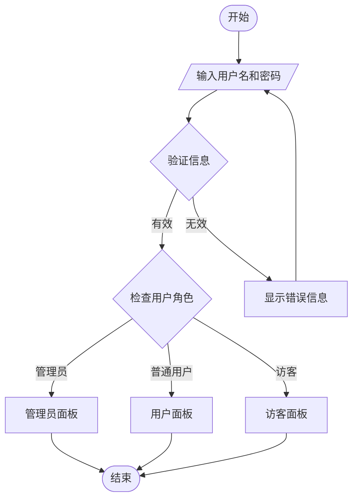

### 节点形状
- `A[矩形]` - 矩形
- `B(圆角矩形)` - 圆角矩形
- `C{菱形}` - 菱形（判断）
- `D((圆形))` - 圆形
- `E>标签]` - 标签形状
- `F[[子程序]]` - 子程序

### 连接线类型
- `-->` - 实线箭头
- `-.->` - 虚线箭头
- `==>` - 粗实线箭头
- `--` - 实线
- `-.` - 虚线
- `==` - 粗实线

## 2. 序列图 (Sequence Diagram)

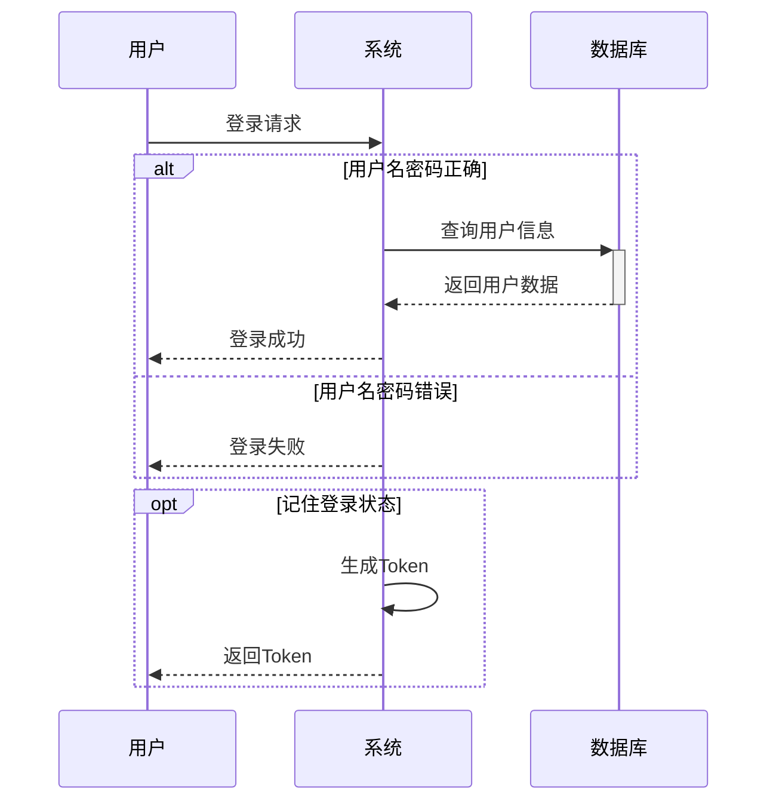

### 消息类型
- `A->>B` - 实线箭头
- `A-->>B` - 虚线箭头
- `A-xB` - 实线叉号
- `A--xB` - 虚线叉号

## 3. 甘特图 (Gantt Chart)

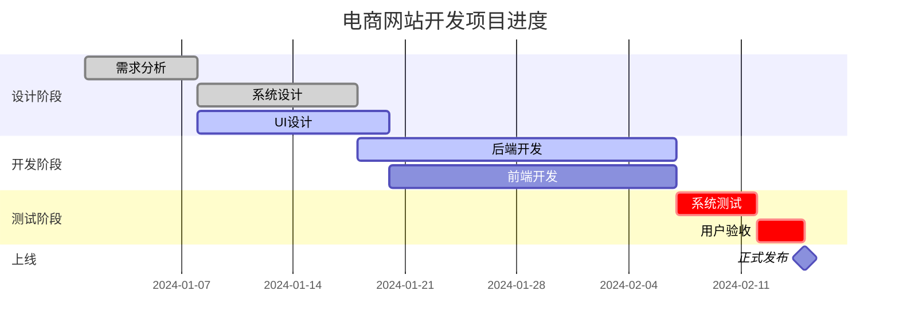

### 任务状态
- `:done` - 已完成
- `:active` - 进行中
- `:crit` - 关键任务
- `:milestone` - 里程碑
- 无标记 - 未开始

## 4. 类图 (Class Diagram)

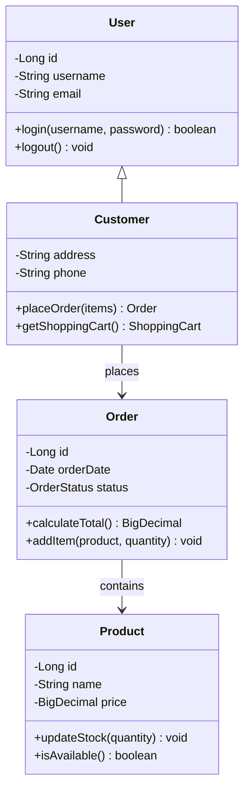

### 关系类型
- `<|--` - 继承
- `*--` - 组合
- `o--` - 聚合
- `-->` - 关联
- `..>` - 依赖
- `..|>` - 实现

### 可见性
- `+` - public
- `-` - private
- `#` - protected
- `~` - package/internal

## 5. 状态图 (State Diagram)

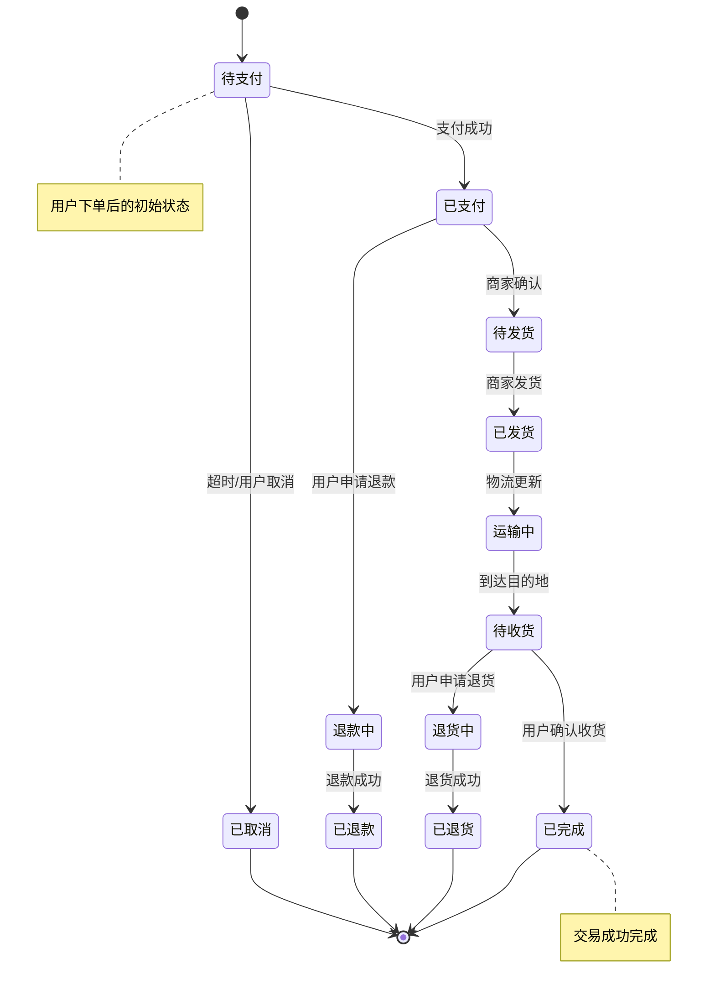

## 6. 饼图 (Pie Chart)

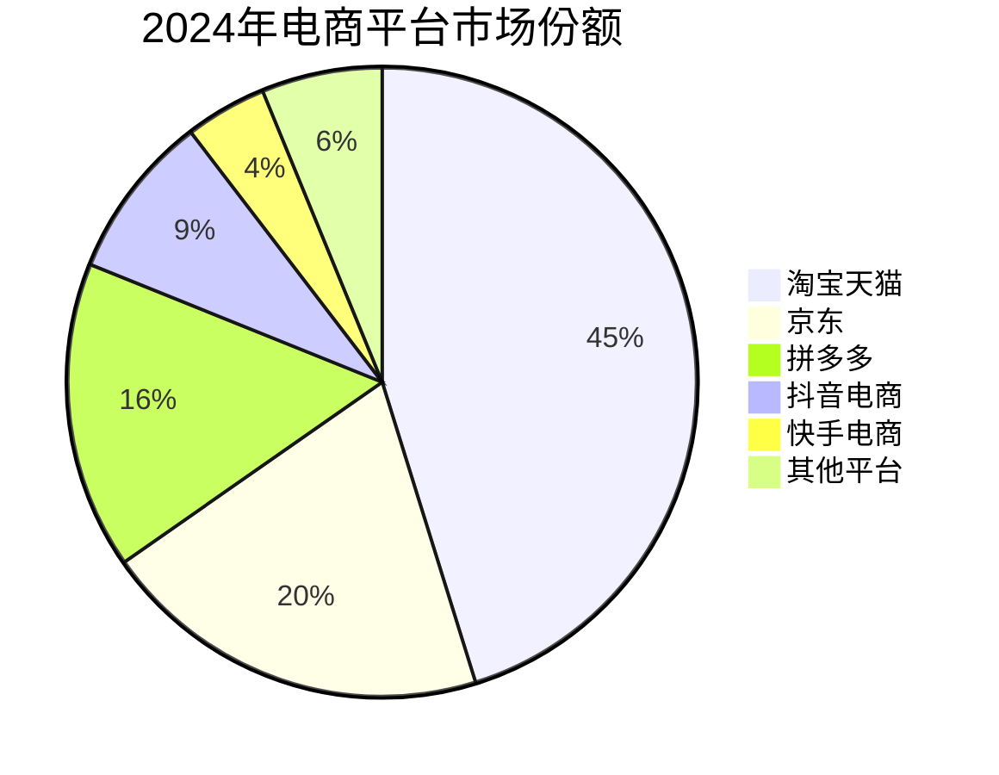

## 7. 实体关系图 (ER Diagram)

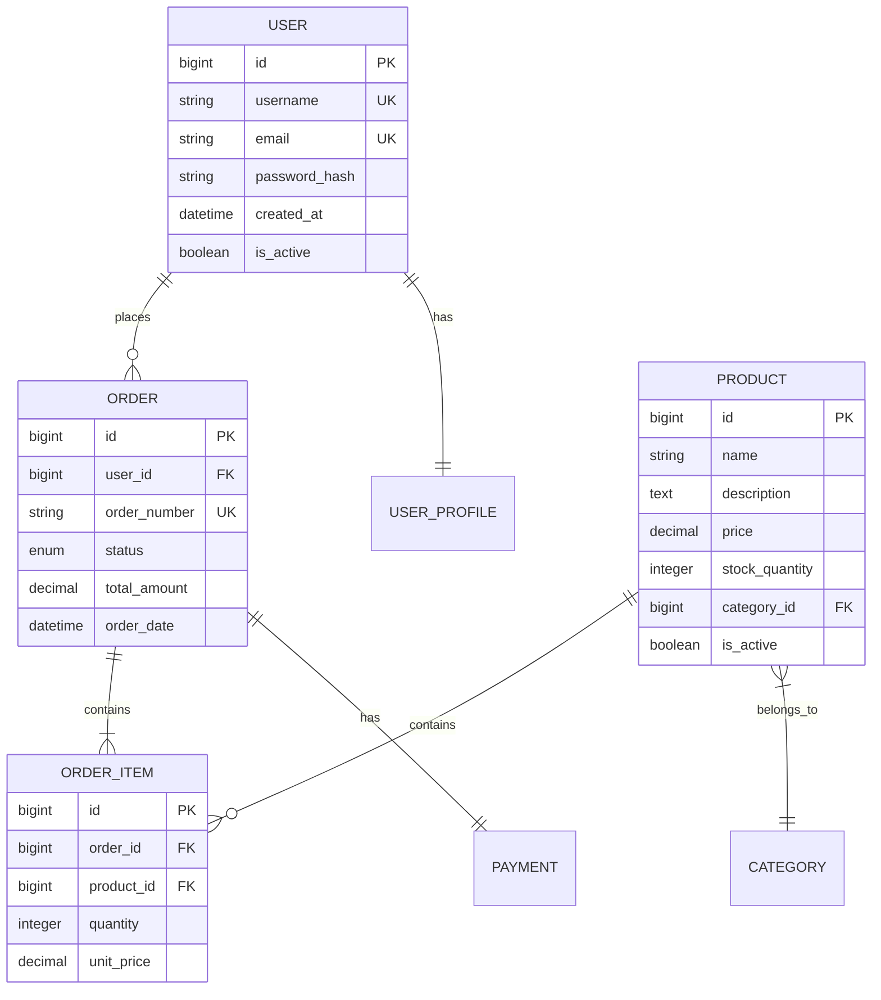

### 关系类型
- `||--||` - 一对一关系
- `||--o{` - 一对多关系
- `}|--||` - 多对一关系
- `}|--|{` - 多对多关系

### 字段类型
- `PK` - 主键 (Primary Key)
- `FK` - 外键 (Foreign Key)
- `UK` - 唯一键 (Unique Key)

## 8. 用户旅程图 (User Journey)

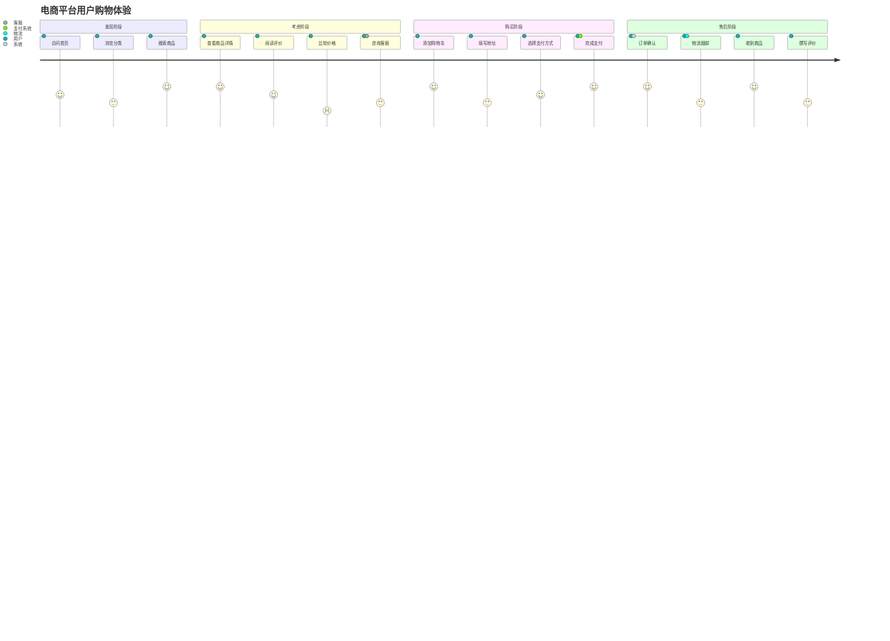

### 评分说明
- 1分：非常糟糕的体验
- 2分：糟糕的体验
- 3分：一般的体验
- 4分：良好的体验
- 5分：优秀的体验

## 9. 思维导图 (Mind Map)

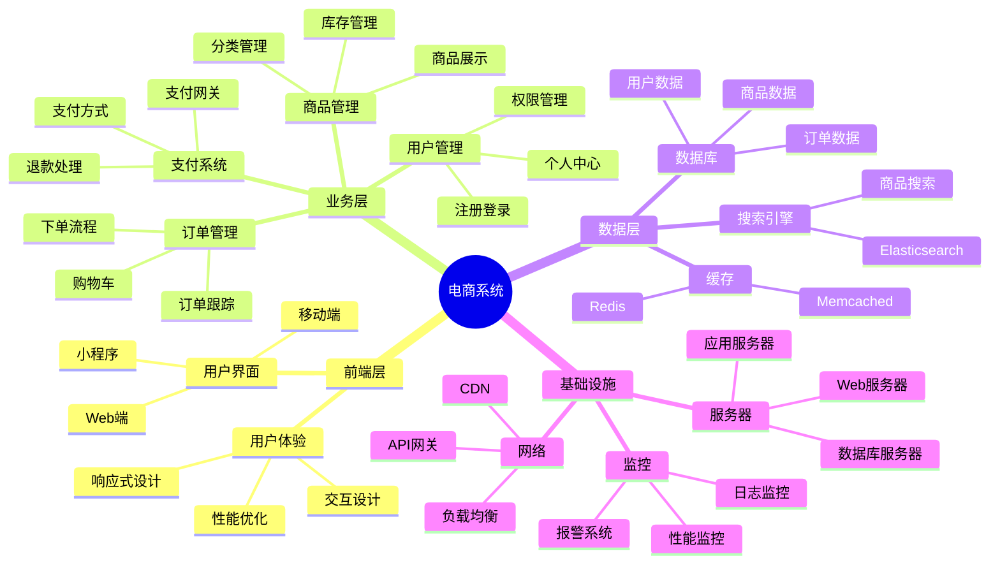

## 10. 时间线图 (Timeline)

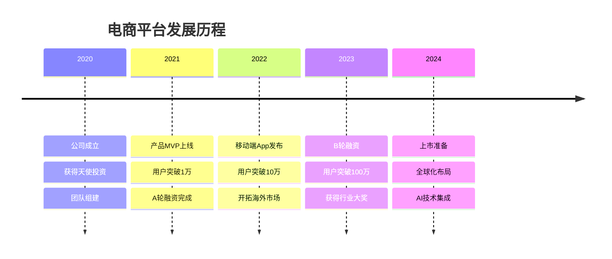

## 11. 象限图 (Quadrant Chart)

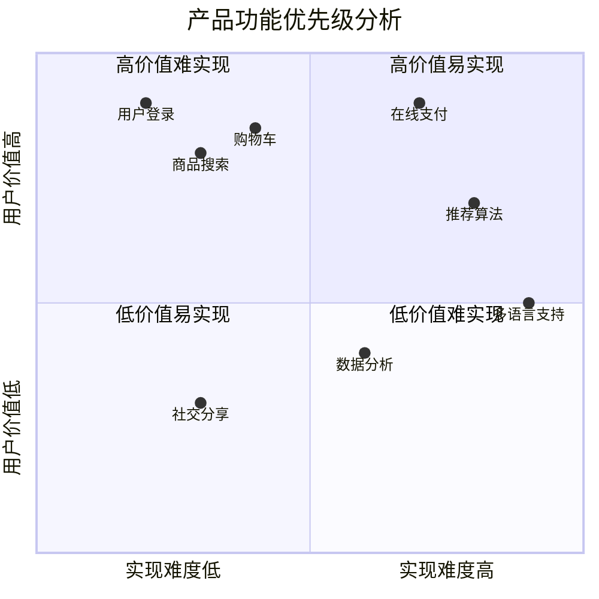

## 常用配置选项

### 主题设置
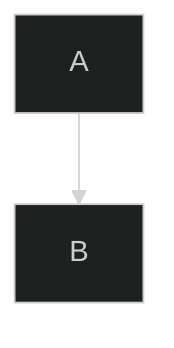

可用主题：`default`, `dark`, `forest`, `neutral`, `base`

### 方向设置
- `TD` / `TB` - 从上到下
- `BT` - 从下到上
- `LR` - 从左到右
- `RL` - 从右到左

## 注意事项

1. 节点ID不能包含特殊字符，建议使用字母和数字
2. 中文文本建议用引号包围
3. 复杂图表建议分段绘制
4. 注意语法的严格性，缩进和符号要准确
5. 可以使用 `%%` 添加注释

## 修复mermaid常见问题的方法：
### 问题1：中括号内的括号无法识别问题
>解决方案：将中括号[]内的括号()改为尖括号<>，例如：
- 正确案例
C -- 否 --> E[直接执行 bmad.js <非 npx 场景, 可能仅是代理>];
E --> F{Agent与用户互动以细化内容 <tasks/advanced-elicitation.md>};
D --> E(pm 代理>); //这是正确的因为它不在中括号内
D --> E{需要工具操作吗};
H --> H1[将新学习/解决方案保存到 memory];
- 错误案例
C -- 否 --> E[直接执行 bmad.js (非 npx 场景, 可能仅是代理)];
E --> F{Agent与用户互动以细化内容 (tasks/advanced-elicitation.md)};
D --> E{需要工具操作吗？};
H --> H1[将新学习/解决方案保存到 memory/]; //中括号内结尾不能是斜杠/

## 在线工具

- [Mermaid Live Editor](https://mermaid.live/) - 在线编辑器
- [GitHub](https://github.com) - 原生支持 Mermaid
- [GitLab](https://gitlab.com) - 原生支持 Mermaid
