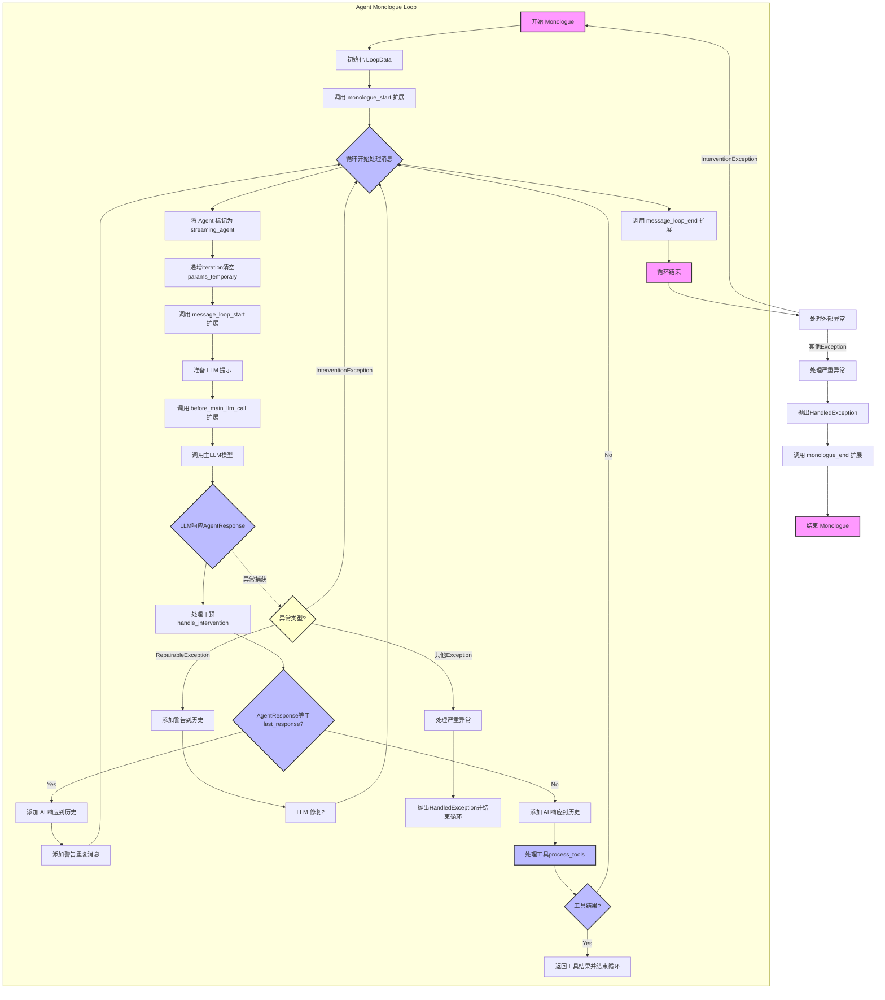
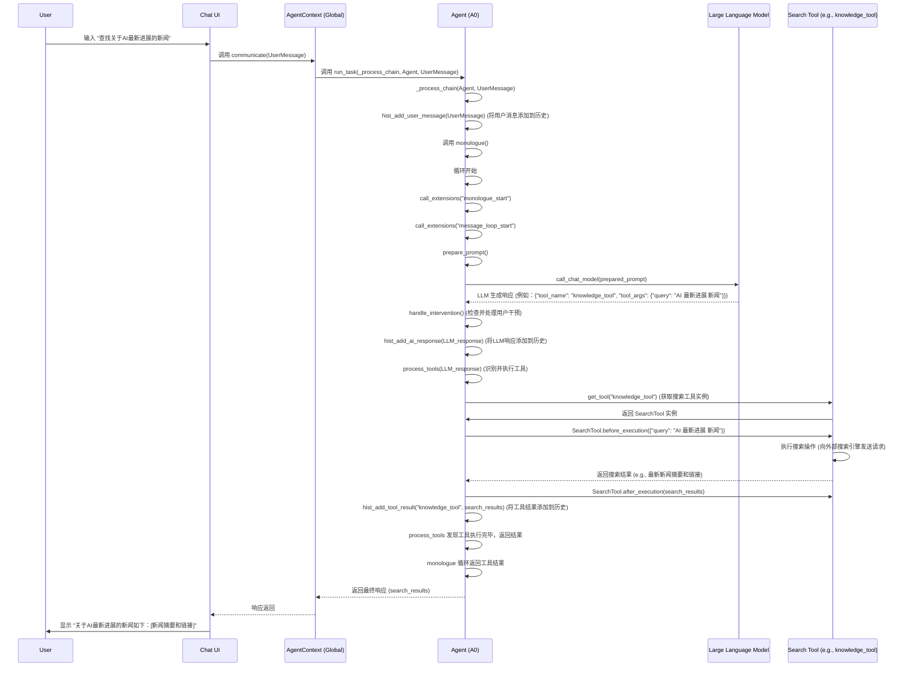

# Agent Zero - `agent.py` 文件功能深入分析报告

### 核心功能总结：

`agent.py` 文件定义了 `Agent Zero` 框架中的核心 `Agent` 类及其相关的上下文 (`AgentContext`) 和配置 (`AgentConfig`)。它是整个系统的中枢神经，负责驱动 AI 代理的决策、交互和行动。其核心功能可以总结为以下几个方面：

1.  **代理生命周期管理**: `AgentContext` 类负责代理的创建、销毁、暂停/恢复、日志记录以及全局上下文的管理。它为 `Agent` 实例提供了一个稳定的运行环境。
2.  **配置驱动的行为**: `AgentConfig` 类允许通过外部配置来高度定制 `Agent` 的行为，包括选择不同的 LLM 模型、定义提示模板路径、配置记忆和知识库子目录，以及设置代码执行环境（Docker/SSH）。这使得 `Agent` 能够灵活适应不同的任务和部署需求。
3.  **智能消息处理循环 (Monologue)**: `Agent` 的 `monologue` 方法是其“大脑”的核心循环。它持续：
    *   **构建和准备提示**: 整合系统指令、历史消息和动态上下文，生成发送给 LLM 的提示。
    *   **与 LLM 交互**: 调用不同的 LLM 模型（聊天、工具、嵌入、浏览器）来获取响应、推理和生成内容。
    *   **处理流式输出**: 支持对 LLM 响应和推理过程的流式处理，提高用户体验。
    *   **工具识别与执行**: 从 LLM 的响应中解析工具调用请求，并动态地查找、实例化和执行相应的工具。这是 `Agent` 与外部环境交互并采取行动的关键。
    *   **历史记录管理**: 维护对话历史，确保 LLM 能够理解上下文，并使得代理的交互连贯。
    *   **异常处理**: 包含健壮的异常处理机制，能够区分可修复和不可修复的错误，并采取适当的日志记录或终止措施。
    *   **用户干预机制**: 允许在 `Agent` 的消息循环中实时注入用户指令，提供了对代理行为的高度控制。
4.  **强大的可扩展性**: 通过 `call_extensions` 方法，`Agent` 在其生命周期和消息处理流程中的多个关键点提供了钩子。这使得开发者可以通过添加外部扩展来轻松地增加新功能、修改现有行为或集成第三方服务，而无需修改核心 `Agent` 代码。
5.  **模块化设计**: `Agent` 将不同的功能（如模型交互、提示加载、工具管理、历史记录）委托给独立的模块和辅助函数，提高了代码的可读性、可维护性和可测试性。
6.  **错误恢复与日志**: 全面的错误处理和日志记录功能确保了系统在遇到问题时能够提供详细的诊断信息，并尽可能地从错误中恢复。

### 1. `AgentContext` 类分析

- **职责**: `AgentContext` 类负责管理代理的运行上下文。这包括代理的唯一标识符、名称、配置、日志、关联的代理实例（`agent0` 和 `streaming_agent`）、任务（`DeferredTask`）、创建时间、类型和最后消息时间。它还维护一个全局的上下文实例字典 `_contexts`，允许通过 ID 查找、获取所有上下文或获取第一个上下文，以及移除上下文。
- **上下文管理**:
    - `id`: 唯一的上下文 ID，如果未提供则自动生成。
    - `name`: 上下文的名称。
    - `config`: 关联的 `AgentConfig` 实例，包含了代理的各种配置。
    - `log`: 一个 `Log.Log` 实例，用于记录代理的日志。
    - `agent0`: 初始的 `Agent` 实例。
    - `streaming_agent`: 当前正在进行流式响应的 `Agent` 实例。
    - `task`: 一个 `DeferredTask` 实例，用于管理异步任务。当上下文被移除或重置时，如果任务存在，它会被杀死。
    - `paused`: 布尔值，指示上下文是否处于暂停状态。
    - `created_at`: 上下文的创建时间。
    - `type`: `AgentContextType` 枚举类型，指示上下文的类型（用户、任务或 MCP）。
    - `last_message`: 最后一条消息的时间。
- **全局管理**:
    - `_contexts`: 静态字典，存储所有 `AgentContext` 实例，以 ID 为键。
    - `_counter`: 静态计数器，用于生成上下文的序列号 `no`。
    - `get(id)`: 静态方法，通过 ID 获取 `AgentContext` 实例。
    - `first()`: 静态方法，获取第一个 `AgentContext` 实例。
    - `all()`: 静态方法，获取所有 `AgentContext` 实例的列表。
    - `remove(id)`: 静态方法，通过 ID 移除 `AgentContext` 实例，并杀死其关联的任务。
- **序列化**:
    - `serialize()`: 将 `AgentContext` 实例的重要属性序列化为字典，以便于存储或传输。
- **日志记录**:
    - `log_to_all()`: 静态方法，允许向所有活跃的 `AgentContext` 实例的日志中记录信息。
- **生命周期管理**:
    - `kill_process()`: 杀死当前上下文关联的 `DeferredTask`。
    - `reset()`: 重置上下文状态。
- **交互方式**:
    - `nudge()`: 唤醒被暂停的代理，重新启动其 `monologue` 任务。
    - `get_agent()`: 返回当前正在流式响应的代理 (`streaming_agent`) 或主代理 (`agent0`)。
    - `communicate(msg)`: 用于接收用户消息并启动或介入代理的消息处理链。
    - `run_task()`: 用于启动一个异步任务 (`DeferredTask`)。
    - `_process_chain()`: 处理消息链，包括添加用户消息或工具结果到历史记录，调用代理的 `monologue`，并处理与上级代理的通信。

### 2. `AgentConfig` 类分析

`AgentConfig` 是一个数据类 (`@dataclass`)，它封装了 `Agent` 运行所需的各种配置参数。这些参数主要分为模型配置、路径配置和代码执行环境配置。

- **模型配置**: `chat_model`, `utility_model`, `embeddings_model`, `browser_model`。
- **路径配置**: `mcp_servers`, `prompts_subdir`, `memory_subdir`, `knowledge_subdirs`。
- **代码执行环境配置**: `code_exec_docker_enabled`, `code_exec_docker_name`, `code_exec_docker_image`, `code_exec_docker_ports`, `code_exec_docker_volumes`, `code_exec_ssh_enabled`, `code_exec_ssh_addr`, `code_exec_ssh_port`, `code_exec_ssh_user`, `code_exec_ssh_pass`。
- **其他配置**: `additional`。

这些配置直接决定了 `Agent` 的模型选择和行为、提示和个性化、记忆和知识管理、代码执行方式以及多代理通信能力。

### 3. `Agent` 类方法与属性分析

#### 3.1. `__init__` 方法

- 负责初始化 `Agent` 实例的关键属性，包括其配置 (`config`)、上下文 (`context`)、编号 (`number`)、名称 (`agent_name`)、历史记录 (`history`)、最后的用户消息 (`last_user_message`)、干预消息 (`intervention`) 和通用数据存储 (`data`)。
- 建立 `Agent` 与 `AgentConfig` 及 `AgentContext` 之间的紧密关联。

#### 3.2. `monologue` 方法

- `Agent` 的核心消息处理循环，持续运行直到任务完成或遇到致命异常。
- **主要流程**: 初始化 `LoopData` -> 调用 `monologue_start` 扩展 -> 进入内部循环 -> 标记当前 `Agent` 为 `streaming_agent` -> 递增迭代次数 -> 调用 `message_loop_start` 扩展 -> 准备 LLM 提示 -> 调用 `before_main_llm_call` 扩展 -> 调用主 LLM (`call_chat_model`) -> 处理用户干预 (`handle_intervention`) -> 检查响应是否重复 -> 添加 AI 响应到历史 -> 处理工具调用 (`process_tools`) -> 循环继续或返回工具结果。
- **异常处理**: 内部循环捕获 `InterventionException`（跳过当前迭代）、`RepairableException`（反馈给 LLM 尝试修复）和一般 `Exception`（调用 `handle_critical_exception` 终止）。
- **扩展点**: 提供了 `monologue_start`, `message_loop_start`, `before_main_llm_call`, `message_loop_end`, `monologue_end` 等多个扩展点。

#### 3.3. `prepare_prompt` 方法

- 负责构建发送给 LLM 的完整提示。
- **流程**: 设置进度 -> 调用 `message_loop_prompts_before` 扩展 -> 获取系统提示 (`get_system_prompt`) -> 获取历史记录 -> 调用 `message_loop_prompts_after` 扩展 -> 拼接系统提示 -> 拼接额外信息 -> 清除临时额外信息 -> 将历史和额外信息转换为 LLM 格式 -> 构建最终提示 -> 存储上下文窗口内容及其令牌计数 -> 返回完整提示。

#### 3.4. `handle_critical_exception` 方法

- `Agent` 异常处理机制的核心，用于捕获和处理严重异常。
- **处理逻辑**:
    - `HandledException`: 直接重新抛出。
    - `asyncio.CancelledError`: 打印终止信息，并包装为 `HandledException` 重新抛出。
    - 其他 `Exception`: 格式化错误信息，打印到控制台，记录到日志，并包装为 `HandledException` 重新抛出，以终止循环。

#### 3.5. `get_system_prompt` 方法

- 用于收集并返回 LLM 系统提示的字符串列表。
- **核心**: 通过调用 `system_prompt` 扩展来实现，使得系统提示的生成具有高度动态性和可扩展性。

#### 3.6. `parse_prompt` 和 `read_prompt` 方法

- **共同点**: 都用于从文件系统读取提示模板，支持自定义提示子目录和备用目录。
- **`parse_prompt`**: 调用 `files.parse_file()`，用于解析可能包含结构化数据或需要特殊处理的提示文件。
- **`read_prompt`**: 调用 `files.read_file()`，用于读取纯文本提示文件，并调用 `files.remove_code_fences()` 移除代码围栏。

#### 3.7. `hist_add_*` 方法

- 封装了 `Agent` 与其内部 `history.History` 对象交互的逻辑，负责将不同类型的消息添加到历史记录中。
- 包括：
    - `hist_add_message`: 核心辅助方法，实际添加消息。
    - `hist_add_user_message`: 添加用户消息（包括干预）。
    - `hist_add_ai_response`: 添加 AI 响应。
    - `hist_add_warning`: 添加警告信息。
    - `hist_add_tool_result`: 添加工具执行结果。
    - `concat_messages`: 将历史消息串联成文本字符串。

#### 3.8. `get_*_model` 和 `call_*_model` 方法

- `Agent` 与底层 LLM 交互的接口，封装了模型选择、初始化、速率限制和实际调用逻辑。
- **`get_*_model`**: `get_chat_model`, `get_utility_model`, `get_browser_model`, `get_embedding_model`，用于获取不同类型的模型实例。
- **`call_*_model`**: `call_utility_model`, `call_chat_model`，负责调用模型，处理流式响应、令牌计算、速率限制，并支持用户干预。

#### 3.9. `rate_limiter` 方法

- 管理与外部 LLM API 交互频率的核心机制，确保不会超出 API 的速率限制。
- **功能**: 获取速率限制器实例，添加输入令牌和请求，并在需要时暂停执行，通过回调函数更新日志和进度。

#### 3.10. `handle_intervention` 方法

- 响应外部干预的关键机制，允许在代理的正常操作流中注入新的指令或修正。
- **流程**: 等待代理未暂停 -> 检查干预消息是否存在 -> 添加干预消息到历史 -> 抛出 `InterventionException`，强制代理重新评估状态。

#### 3.11. `process_tools` 方法

- `Agent` 智能和能力的直接体现，负责解析 LLM 响应中的工具请求，并执行工具。
- **流程**: 解析工具请求 -> 提取工具信息 -> 尝试从 MCP 获取工具 -> 回退到本地 `get_tool` -> 如果找到工具，则在 `handle_intervention` 检查点后执行 `before_execution`、`execute` 和 `after_execution` 方法 -> 根据工具结果决定是否中断消息循环。

#### 3.12. `get_tool` 方法

- 获取并实例化本地工具的核心方法。
- **功能**: 动态加载指定目录下的工具类（继承自 `Tool` 基类），如果找不到则使用 `Unknown` 工具类作为回退，并实例化工具对象，将 `Agent` 实例及其他上下文信息传递给工具构造函数。

#### 3.13. `call_extensions` 方法

- `Agent` 架构中一个非常重要的扩展点，允许在代理生命周期和消息处理循环中的特定阶段执行外部定义的逻辑。
- **功能**: 从指定目录动态加载扩展类（继承自 `Extension` 基类），缓存已加载的类以提高效率，并实例化每个扩展并调用其 `execute` 方法，传入 `Agent` 实例和运行时上下文参数。

### 4. `Agent` 主要操作流程 Mermaid 图

### 5. 潜在改进方向

1.  **更细粒度的并发控制和任务调度**: 引入高级并发原语或任务队列，优化复杂任务的执行效率。
2.  **增强的工具定义和发现机制**: 引入工具注册表或正式的工具协议，提高工具管理的健壮性。
3.  **可插拔的记忆和知识管理**: 为记忆和知识库引入抽象接口和多种后端实现。
4.  **结构化日志和监控**: 增强日志输出为结构化格式，并集成专业监控工具。
5.  **更智能的异常处理和自我修复**: 探索更复杂的自我修复策略，减少人工干预。
6.  **统一的配置加载和验证**: 引入统一的配置加载器和严格的模式验证。
7.  **异步操作的超时和重试机制**: 为网络操作添加超时和指数退避重试逻辑。

### 6. 实际使用示例：Agent 执行流程详解 (从用户输入“查找关于AI最新进展的新闻”开始)

以下是一个详细的 `Agent Zero` 执行流程示例，展示了当用户在聊天界面输入一个需求时，`agent.py` 中定义的 `Agent` 如何响应并完成任务。

**场景**: 用户在聊天界面输入：“查找关于AI最新进展的新闻”。

**详细步骤说明**:

1.  **用户输入**: 用户在聊天界面输入“查找关于AI最新进展的新闻”。
2.  **`Chat UI` 传递消息**: 聊天界面捕获用户输入，并将其封装成一个 `UserMessage` 对象，然后通过底层机制调用 `AgentContext` 的 `communicate()` 方法。
3.  **`AgentContext` 接收**: `AgentContext.communicate()` 接收到 `UserMessage`。它会检查当前是否有 `Agent` 任务在运行。由于这是新的用户输入，它会通过 `run_task()` 启动一个异步任务 `_process_chain()`，并将 `Agent` 实例和 `UserMessage` 传递给它。
4.  **`_process_chain` 启动**:
    *   `_process_chain()` 方法首先调用 `Agent.hist_add_user_message()` 将用户消息添加到 `Agent` 的对话历史中。
    *   接着，它调用 `Agent.monologue()`，这是 `Agent` 的核心消息处理循环。
5.  **`Agent.monologue()` 循环**:
    *   **初始化**: `monologue()` 循环开始，初始化 `LoopData`，并触发 `monologue_start` 扩展。
    *   **消息循环开始**: 每次迭代，`Agent` 会将自身标记为 `streaming_agent`，更新 `LoopData`，并触发 `message_loop_start` 扩展。
    *   **准备提示**: `Agent.prepare_prompt()` 方法被调用。它会聚合系统提示（可能由 `system_prompt` 扩展注入）、当前的对话历史（包括刚刚添加的用户消息）以及任何额外的上下文，构建一个完整的提示 (`prepared_prompt`) 发送给 LLM。
    *   **调用 LLM**: `Agent.call_chat_model()` 被调用，将 `prepared_prompt` 发送给配置的聊天模型 (LLM)。LLM 处理提示，并根据其能力和对提示的理解，生成一个响应。在这个例子中，LLM 识别到用户需要“查找新闻”，因此它决定调用一个名为 `knowledge_tool` (搜索工具) 的工具，并生成一个包含工具名称和参数的 JSON 格式响应。
    *   **处理干预**: `handle_intervention()` 被调用，检查是否有用户在 LLM 响应生成过程中进行了干预。
    *   **添加 LLM 响应到历史**: LLM 的原始响应被添加到 `Agent` 的历史记录中。
    *   **处理工具**: `Agent.process_tools()` 方法被调用，接收 LLM 生成的 JSON 响应。
        *   `process_tools()` 会解析这个 JSON，识别出 `tool_name` 为 "knowledge_tool"，`tool_args` 为 `{"query": "AI 最新进展 新闻"}`。
        *   它会调用 `Agent.get_tool("knowledge_tool")` 来获取 `knowledge_tool` 的实例。
        *   获取到工具实例后，`process_tools()` 会在执行前后调用 `handle_intervention()`，确保用户可以中断工具执行。
        *   接着，它会调用 `SearchTool.before_execution({"query": "AI 最新进展 新闻"})`（如果工具定义了该方法）。
        *   然后，`SearchTool.execute({"query": "AI 最新进展 新闻"})` 方法被执行。这个工具会实际调用一个外部搜索引擎 API (例如，通过 `duckduckgo_search` 模块) 来查找新闻。
        *   搜索结果返回后，`SearchTool.after_execution(search_results)`（如果工具定义了该方法）会被调用。
        *   最后，`Agent.hist_add_tool_result("knowledge_tool", search_results)` 将工具的执行结果（例如，最新新闻的摘要和链接）添加到 `Agent` 的历史记录中。
    *   **循环结束或继续**:
        *   如果工具的执行结果（或工具自身）指示任务已完成或可以返回最终响应（例如，`response.break_loop` 为 `True`），`process_tools()` 会返回该结果，从而中断 `monologue` 循环。
        *   否则，`monologue` 循环将继续，`Agent` 可能会再次调用 LLM，根据工具执行后的新历史记录来决定下一步行动。在这个例子中，工具直接提供了最终信息，因此循环中断。
6.  **结果返回**: `monologue()` 循环终止并返回工具结果。这个结果向上返回给 `_process_chain()`，再返回给 `AgentContext.communicate()`。
7.  **`Chat UI` 显示**: `Chat UI` 接收到 `Agent` 的最终响应（新闻摘要和链接），并将其显示给用户。

通过这个流程，`Agent Zero` 展示了其从理解用户需求到调用外部工具获取信息，再到最终向用户提供响应的完整闭环能力。