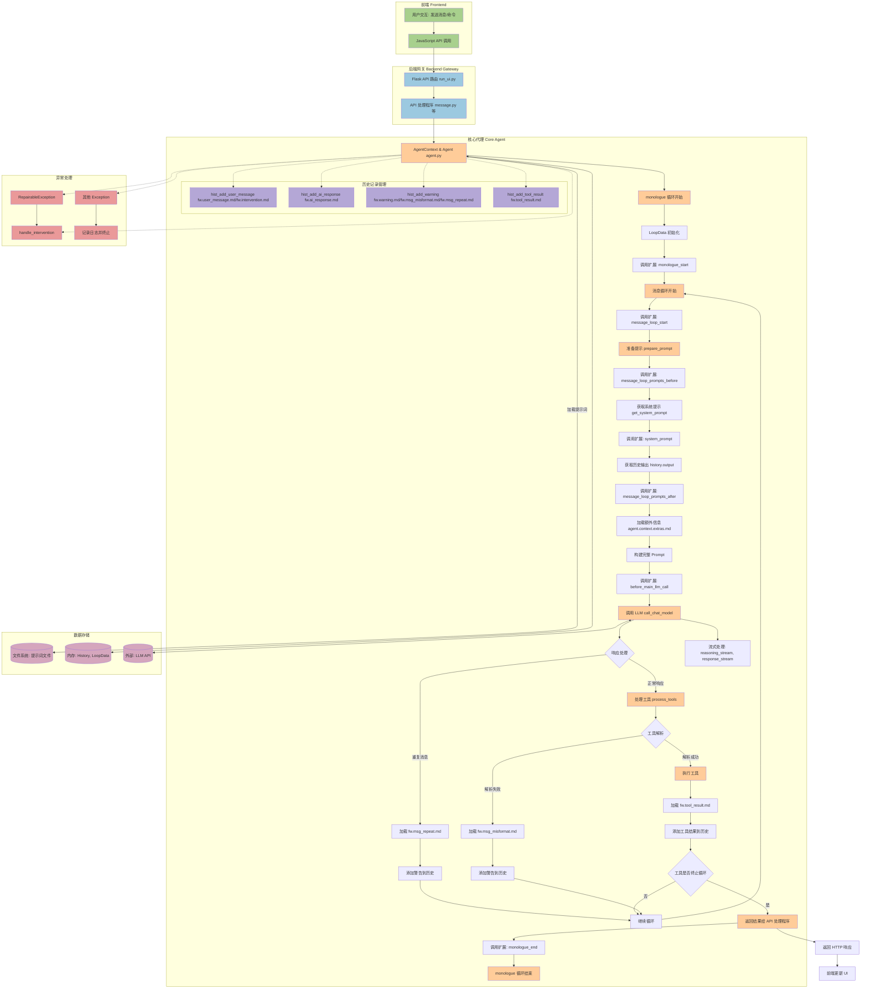

# Agent Zero 核心业务流程分析报告

## 1. `monologue` 方法整体流程和关键扩展点

`monologue` 方法是 `Agent` 类的核心，代表了代理的"独白"或内部思考循环，负责驱动代理的决策、与 LLM 交互以及执行工具。

### 整体流程：

1.  **无限循环**: `while True:` 确保代理持续运行，直到遇到终止条件。
2.  **`LoopData` 初始化**: 每次循环迭代开始时，都会创建一个 `LoopData` 实例，用于存储当前迭代的上下文信息。
3.  **扩展点调用**: `monologue` 方法的核心在于其对 `call_extensions` 的大量使用，这使得代理的行为高度可扩展。
4.  **LLM 交互**: 在每次迭代中，代理会准备提示 (`prepare_prompt`)，然后调用主聊天模型 (`call_chat_model`) 获取响应。
5.  **干预处理**: 在与 LLM 交互和工具执行前后，代理会检查是否有用户干预 (`handle_intervention`)。
6.  **响应检查与警告**: 如果 LLM 的响应与上一次响应相同，代理会添加一个警告消息，提示消息重复。
7.  **工具处理**: 代理会尝试从 LLM 的响应中解析工具使用请求 (`process_tools`)。如果解析成功，就会执行相应的工具。
8.  **循环终止**: 如果工具执行的结果指示 `break_loop` 为 `True`，则 `monologue` 循环终止，并返回工具的响应。
9.  **异常处理**: `monologue` 方法内部和外部都有 `try...except...finally` 块，用于处理各种异常。
10. **流式处理**: 在调用 LLM 时，`reasoning_callback` 和 `stream_callback` 用于处理 LLM 的流式输出。

### 关键扩展点（通过 `call_extensions` 调用）：

*   **`monologue_start`**: 在代理的内部"独白"阶段开始时执行。主要负责根据当前的对话历史，动态地生成和更新聊天会话的名称。
*   **`message_loop_start`**: 在代理的每个消息循环开始时执行。主要功能是跟踪和管理消息循环的迭代次数。
*   **`before_main_llm_call`**: 在主语言模型（LLM）调用之前执行。主要职责是初始化一个日志项，并将其引用存储在 `LoopData` 对象的临时参数中。
*   **`message_loop_prompts_before`**: 在代理的消息循环中，将提示发送给主语言模型（LLM）之前执行。核心功能是确保聊天历史已被适当地压缩和管理。
*   **`message_loop_prompts_after`**: 在代理的消息循环中，主语言模型（LLM）生成回复之后，但在将最终提示发送给 LLM 之前执行。主要负责通过集成相关记忆、解决方案、工具和当前时间信息来增强 LLM 的提示。
*   **`system_prompt`**: 负责在代理与主语言模型（LLM）交互时，动态地构建和配置传递给 LLM 的"系统提示"。
*   **`reasoning_stream`**: 在代理进行内部"推理"（reasoning）过程并流式输出其思考时执行。主要功能是实时捕获并更新这些推理流。
*   **`response_stream`**: 在代理主语言模型（LLM）生成响应并以流式方式传输时执行。核心功能是实时地捕获、处理和显示 LLM 的输出。
*   **`monologue_end`**: 在代理的内部"独白"阶段结束时执行。主要负责将代理在此独白阶段中获得的有用信息（如关键对话片段和解决方案）持久化到记忆系统中，并设置用户界面状态以等待用户输入。

## 2. `call_extensions` 调用及提示词加载方式

`call_extensions` 方法是 `Agent` 动态加载和执行扩展模块的机制。

### 工作原理：

1.  **动态加载**: 接收一个 `folder` 参数，动态地从 `python/extensions/<folder>` 目录下加载所有继承自 `Extension` 基类的 Python 类。
2.  **缓存**: 为了提高效率，会缓存已加载的扩展类。
3.  **实例化和执行**: 对于加载的每一个扩展类，创建一个实例并调用该实例的 `execute` 方法。

### `monologue` 中加载提示词的方式：

*   **间接加载**: `monologue` 通过 `call_extensions` 间接导致提示词文件的加载。具体的提示词加载逻辑存在于各个扩展模块中，或者由 `Agent` 本身的一些方法（如 `parse_prompt`、`read_prompt`）在构建提示时调用。
*   **模块化**: 设计使得提示词和相关的逻辑可以被模块化，不同的扩展可以负责加载不同类型的提示词。
*   **上下文传递**: `call_extensions` 将 `agent` 实例和 `loop_data` 等上下文信息传递给扩展。

## 3. `read_prompt` 和 `parse_prompt` 函数逻辑

这两个函数负责从文件系统中读取和解析提示词文件。

### 共同逻辑：

1.  **默认提示词目录**: 首先尝试从 `prompts/default` 目录加载提示词文件。
2.  **自定义提示词目录 (`self.config.prompts_subdir`)**:
    *   如果 `self.config.prompts_subdir` 存在，主要的提示词查找路径会变为 `prompts/<prompts_subdir>`。
    *   在这种情况下，`prompts/default` 目录会被添加为备用目录 (`_backup_dirs`)。
3.  **文件路径构建**: 使用 `files.get_abs_path` 函数构建文件的绝对路径。
4.  **备用目录 (`_backup_dirs`)**: 允许在主路径中找不到文件时，按顺序在指定的备用目录中继续查找。

### `read_prompt(self, file: str, **kwargs) -> str`

*   **功能**: 用于读取纯文本提示词文件。
*   **实现**:
    *   调用 `files.read_file`。
    *   最后，`files.remove_code_fences(prompt)` 会移除代码块的围栏。

### `parse_prompt(self, file: str, **kwargs)`

*   **功能**: 用于解析更结构化的提示词文件（例如 YAML 或 JSON 格式的提示）。
*   **实现**:
    *   调用 `files.parse_file`。
    *   会读取文件内容，并尝试将其解析为 Python 对象（例如字典）。

## 4. `monologue` 使用的具体提示词文件

1.  `fw.msg_repeat.md`
2.  `fw.msg_misformat.md`
3.  `agent.context.extras.md`
4.  `fw.intervention.md`
5.  `fw.user_message.md`
6.  `fw.ai_response.md`
7.  `fw.warning.md`
8.  `fw.tool_result.md`

## 5. 每个提示词文件的功能和内容

这些提示词文件主要用于构建代理内部的历史记录（`history`）。

1.  **`fw.msg_repeat.md`**
    *   **功能**: 当检测到重复消息时的警告。
    *   **内容**: 纯文本 "You have sent the same message again. You have to do something else!"

2.  **`fw.msg_misformat.md`**
    *   **功能**: 当消息格式不正确时的警告。
    *   **内容**: 纯文本 "You have misformatted your message. Follow system prompt instructions on JSON message formatting precisely."

3.  **`agent.context.extras.md`**
    *   **功能**: 在构建提示时注入额外上下文信息。
    *   **内容**: 纯文本 "[EXTRAS]\n{{extras}}"。

4.  **`fw.intervention.md`**
    *   **功能**: 结构化表示用户的干预消息。
    *   **内容**: JSON 模板，包含 `system_message`, `user_intervention`, `attachments`。

5.  **`fw.user_message.md`**
    *   **功能**: 结构化表示用户的普通消息。
    *   **内容**: JSON 模板，包含 `system_message`, `user_message`, `attachments`。

6.  **`fw.ai_response.md`**
    *   **功能**: 表示 LLM 的响应。
    *   **内容**: 模板 "{{message}}"。

7.  **`fw.warning.md`**
    *   **功能**: 结构化表示系统警告信息。
    *   **内容**: JSON 模板，包含 `system_warning`。

8.  **`fw.tool_result.md`**
    *   **功能**: 结构化表示工具执行结果。
    *   **内容**: JSON 模板，包含 `tool_name`, `tool_result`。

## 6. 提示词文件的依赖关系和整体流程

### 依赖关系:

1.  **无直接依赖**: `fw.msg_repeat.md`, `fw.msg_misformat.md`, `agent.context.extras.md`, `fw.ai_response.md` 是相对独立的。
2.  **间接依赖**: `fw.intervention.md` 等 JSON 模板的输出会成为历史记录的一部分，影响最终提示。
3.  **系统提示词**: `system_prompt` 扩展会加载核心系统提示词文件（未在本次分析中列出），它们是所有交互的基础。

### 整体流程:

1.  **消息接收与历史记录初始化**: 用户消息通过 API 到达，`Agent` 使用 `fw.user_message.md` 或 `fw.intervention.md` 将其添加到历史记录。
2.  **代理内部循环 (`monologue`)**:
    *   **提示构建**: `prepare_prompt` 结合系统提示、历史消息和 `agent.context.extras.md` 构建完整提示。
    *   **LLM 调用**: 使用构建好的提示调用 LLM。
    *   **响应处理**: 检查重复，否则调用 `process_tools`。
    *   **工具执行与结果记录**: 工具执行后，使用 `fw.tool_result.md` 将结果添加到历史记录。
    *   **错误与警告处理**: 出现错误时，使用 `fw.warning.md` 或 `fw.msg_misformat.md` 添加警告。
3.  **循环终止**: 工具指示 `break_loop=True` 时，循环结束，返回响应。

## 7. 业务流程和数据流转图

### 图表说明：

*   **颜色编码**:
    *   绿色 (前端): 用户交互和前端逻辑。
    *   蓝色 (后端网关): Flask 服务器和 API 路由处理。
    *   橙色 (核心代理): `Agent` 类和 `monologue` 循环的核心逻辑。
    *   紫色 (数据存储): 文件系统（提示词）、内存（历史记录）和外部 LLM API。
    *   灰紫色 (历史记录管理): 管理不同类型消息添加到历史记录的辅助方法。
    *   红色 (异常处理): 处理干预和各种异常的逻辑。
*   **流程**:
    *   数据从用户交互开始，通过前端 API 调用，经过后端网关路由到具体的 API 处理程序。
    *   API 处理程序与 `AgentContext` 和 `Agent` 交互，启动 `monologue` 循环。
    *   `monologue` 循环通过调用各种扩展点和方法，构建提示、调用 LLM、处理响应和工具。
    *   在这个过程中，会加载和使用各种提示词文件 (`fw.*.md`, `agent.context.extras.md`) 来构建历史记录和提示。
    *   历史记录被存储在内存中，用于后续的提示构建。
    *   LLM 的调用是与外部服务的交互。
    *   异常处理机制贯穿整个流程，确保系统的稳定性和正确响应用户干预。
    *   当循环结束时，结果通过 API 层返回给前端，更新用户界面。