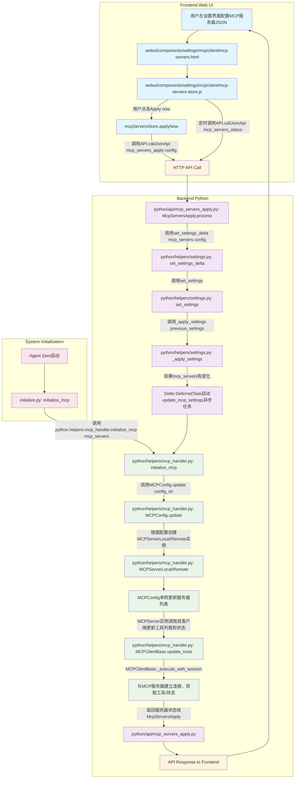

# MCP 配置和加载业务流程及代码实现细节分析报告

### 1. 概述

本报告详细分析了 Agent Zero 中 MCP（Multi-Configurable Process）配置从前端 UI 输入到后端加载和生效的整个业务流程。MCP 机制允许 Agent Zero 作为客户端连接外部 MCP 服务器（本地或远程），并作为服务器对外提供自身能力。

### 2. 核心概念与文件

*   **MCP (Multi-Configurable Process):** 一种用于 Agent Zero 与外部工具服务器（无论是本地的基于标准 IO 的进程，还是远程的 HTTP/SSE 服务）进行通信的协议和框架。
*   **`webui/components/settings/mcp/client/mcp-servers.html`**: MCP 服务器配置的前端 HTML 界面。
*   **`webui/components/settings/mcp/client/mcp-servers-store.js`**: 管理前端 MCP 配置界面状态和逻辑的 Alpine.js store。
*   **`python/api/mcp_servers_apply.py`**: 处理前端提交 MCP 配置的后端 API 入口。
*   **`python/helpers/settings.py`**: 负责系统设置的读取、写入、更新和应用，包括 MCP 配置的持久化和热加载。
*   **`python/helpers/mcp_handler.py`**: Agent Zero 作为 MCP 客户端的核心逻辑，包括 `MCPConfig` 单例、`MCPServer` (本地/远程) 抽象以及 `MCPClient` (本地/远程) 实现，用于与外部 MCP 服务器交互。
*   **`python/helpers/mcp_server.py`**: Agent Zero 作为 MCP 服务器的核心逻辑，对外暴露 Agent Zero 的能力（如 `send_message` 工具）。
*   **`initialize.py`**: 系统启动时的初始化入口，负责加载初始设置和初始化 MCP 客户端。

### 3. 业务流程与代码实现细节

以下是 MCP 配置和加载的详细业务流程，结合了前端和后端实现。

#### 3.1 用户操作与前端交互

1.  **配置输入**: 用户通过浏览器访问 Agent Zero 的 Web UI，进入设置页面。在 MCP 服务器配置部分，用户以 JSON 格式输入或修改外部 MCP 服务器的详细信息。
    *   **文件**: [`webui/components/settings/mcp/client/mcp-servers.html`](webui/components/settings/mcp/client/mcp-servers.html)
    *   **实现**: 该 HTML 文件使用 Alpine.js (`x-data`, `x-for` 等指令) 构建动态界面。用户输入的 JSON 配置通过 Ace Editor 组件 (`#mcp-servers-config-json`) 进行展示和编辑。
2.  **状态管理**: `mcp-servers-store.js` ([`webui/components/settings/mcp/client/mcp-servers-store.js:1`](webui/components/settings/mcp/client/mcp-servers-store.js:1)) 作为前端状态管理的核心。
    *   **初始化**: `mcpServersStore.initialize()` ([`webui/components/settings/mcp/client/mcp-servers-store.js:13`](webui/components/settings/mcp/client/mcp-servers-store.js:13)) 在组件挂载时初始化 Ace Editor 并加载现有配置。
    *   **JSON 格式化**: `mcpServersStore.formatJson()` ([`webui/components/settings/mcp/client/mcp-servers-store.js:36`](webui/components/settings/mcp/client/mcp-servers-store.js:36)) 提供 JSON 格式化功能。
    *   **状态轮询**: `mcpServersStore.startStatusCheck()` ([`webui/components/settings/mcp/client/mcp-servers-store.js:73`](webui/components/settings/mcp/client/mcp-servers-store.js:73)) 异步定期调用 `_statusCheck()` ([`webui/components/settings/mcp/client/mcp-servers-store.js:87`](webui/components/settings/mcp/client/mcp-servers-store.js:87))。该方法通过 `API.callJsonApi("mcp_servers_status", null)` 向后端请求最新的 MCP 服务器连接状态和工具数量，并在 UI 上实时更新。
3.  **配置提交**: 用户点击 "Apply now" 按钮。
    *   **触发**: `mcpServersStore.applyNow()` ([`webui/components/settings/mcp/client/mcp-servers-store.js:99`](webui/components/settings/mcp/client/mcp-servers-store.js:99)) 方法被调用。
    *   **API 调用**: 该方法通过 `API.callJsonApi("mcp_servers_apply", { mcp_servers: this.getEditorValue() })` ([`webui/components/settings/mcp/client/mcp-servers-store.js:104`](webui/components/settings/mcp/client/mcp-servers-store.js:104)) 向后端发送 HTTP POST 请求。请求体中包含了用户在 Ace Editor 中编辑的 MCP 服务器配置 JSON 字符串。`API.callJsonApi` 是一个通用的前端工具函数，负责向后端发送 JSON 请求。

#### 3.2 后端 API 处理与设置更新

1.  **API 接收**: 前端发送的 `mcp_servers_apply` 请求被 Agent Zero 后端接收。
    *   **文件**: [`python/api/mcp_servers_apply.py`](python/api/mcp_servers_apply.py)
    *   **类/方法**: `McpServersApply` 类 ([`python/api/mcp_servers_apply.py:10`](python/api/mcp_servers_apply.py:10)) 的 `process()` 方法 ([`python/api/mcp_servers_apply.py:11`](python/api/mcp_servers_apply.py:11)) 负责处理此请求。
2.  **设置更新中转**: `process()` 方法从请求输入中提取 `mcp_servers` JSON 字符串。
    *   **关键调用**: 它不直接处理 MCP 配置的加载，而是通过两次调用 `python.helpers.settings.set_settings_delta()` ([`python/api/mcp_servers_apply.py:15`](python/api/mcp_servers_apply.py:15), [`python/api/mcp_servers_apply.py:16`](python/api/mcp_servers_apply.py:16)) 来更新系统设置。首先将 `mcp_servers` 设置为空字符串 `[]`，然后用新的配置字符串更新，这确保了 MCP 配置的强制重新初始化。
    *   **返回状态**: 在设置更新后，它会调用 `MCPConfig.get_instance().get_servers_status()` ([`python/api/mcp_servers_apply.py:20`](python/api/mcp_servers_apply.py:20)) 获取当前 MCP 服务器的状态，并作为 API 响应返回给前端，供 UI 更新显示。
3.  **设置持久化与应用触发**: `python/helpers/settings.py` 负责整个 Agent Zero 的设置管理。
    *   **增量更新**: `set_settings_delta(delta: dict, apply: bool = True)` ([`python/helpers/settings.py:915`](python/helpers/settings.py:915)) 接收一个包含更改的字典，将其与当前设置合并，并调用 `set_settings()`。
    *   **写入文件**: `set_settings(settings: Settings, apply: bool = True)` ([`python/helpers/settings.py:906`](python/helpers/settings/settings.py:906)) 会将规范化后的完整设置写入 `tmp/settings.json` 文件，实现持久化。
    *   **应用更改**: 如果 `apply` 参数为 `True`（默认为 `True`），`set_settings()` 会调用 `_apply_settings(previous: Settings | None)` ([`python/helpers/settings.py:1064`](python/helpers/settings/settings.py:1064))。这是设置更改后触发对应模块更新的核心函数。

#### 3.3 后端 MCP 配置加载与初始化

1.  **变更检测与异步任务**: 在 `_apply_settings()` 方法中，存在一个关键逻辑用于检测 MCP 配置的变化。
    *   **条件**: `if not previous or _settings["mcp_servers"] != previous["mcp_servers"]` ([`python/helpers/settings.py:1096`](python/helpers/settings/settings.py:1096))。如果检测到 `mcp_servers` 设置发生改变，则会触发 MCP 的重新加载。
    *   **异步执行**: 为了避免阻塞主线程，`_apply_settings` 会创建一个 `defer.DeferredTask` 来异步执行 `update_mcp_settings` 协程 ([`python/helpers/settings.py:1139`](python/helpers/settings/settings.py:1139))。
    *   **MCP Token 更新**: 同样，如果 `mcp_server_token` 发生变化，也会异步触发 `update_mcp_token` 任务来重新配置 `DynamicMcpProxy` ([`python/helpers/settings.py:1149`](python/helpers/settings/settings.py:1149))。
2.  **MCP 配置核心更新**: `update_mcp_settings` 协程的核心是调用 `MCPConfig.update()`。
    *   **文件**: [`python/helpers/mcp_handler.py`](python/helpers/mcp_handler.py)
    *   **类/方法**: `MCPConfig` 是 Agent Zero 中管理所有外部 MCP 服务器配置的单例类 ([`python/helpers/mcp_handler.py:368`](python/helpers/mcp_handler.py:368))。
    *   **更新逻辑**: `MCPConfig.update(config_str: str)` ([`python/helpers/mcp_handler.py:388`](python/helpers/mcp_handler.py:388)) 方法接收 JSON 格式的配置字符串，并对其进行解析和规范化 (`normalize_config()`)。
    *   **服务器实例化**: 它遍历解析后的服务器配置列表，根据配置中的 `type` (或 `url`/`serverUrl`) 字段，动态实例化 `MCPServerRemote` ([`python/helpers/mcp_handler.py:211`](python/helpers/mcp_handler.py:211))（用于 SSE 或流式 HTTP 服务器）或 `MCPServerLocal` ([`python/helpers/mcp_handler.py:283`](python/helpers/mcp_handler.py:283))（用于本地 StdIO 服务器）对象。这些实例被添加到 `MCPConfig.servers` 列表中。
    *   **错误处理**: 在此过程中，任何解析或实例化错误都会被捕获并记录，无效的服务器配置会被添加到 `disconnected_servers` 列表中。
3.  **MCP 客户端连接与工具发现**: 每个 `MCPServer` 实例在被创建时，都会内部初始化一个对应的 `MCPClient`（`MCPClientRemote` 或 `MCPClientLocal`）。
    *   **文件**: [`python/helpers/mcp_handler.py`](python/helpers/mcp_handler.py)
    *   **基类**: `MCPClientBase` ([`python/helpers/mcp_handler.py:780`](python/helpers/mcp_handler.py:780)) 定义了 MCP 客户端的通用行为。
    *   **连接管理**: `MCPClientBase._execute_with_session()` ([`python/helpers/mcp_handler.py:805`](python/helpers/mcp_handler.py:805)) 负责管理与 MCP 服务器的会话生命周期，确保连接的建立和清理。
    *   **工具更新**: `MCPClientBase.update_tools()` ([`python/helpers/mcp_handler.py:868`](python/helpers/mcp_handler.py:868)) 被调用以异步地从外部 MCP 服务器拉取可用的工具列表、它们的描述和输入 Schema，并将这些工具缓存在 `MCPClient` 实例中。
    *   **工具包装**: 获取到的 MCP 工具信息最终被 Agent Zero 内部的 `MCPTool` 类 ([`python/helpers/mcp_handler.py:99`](python/helpers/mcp_handler.py:99)) 包装，使其可以被 Agent Zero 的工具执行框架调用。

#### 3.4 系统启动时初始化

1.  **启动入口**: 当 Agent Zero 应用启动时，`initialize.py` ([`initialize.py:1`](initialize.py:1)) 是主要的初始化脚本。
2.  **MCP 初始化**: `initialize.py:initialize_mcp()` ([`initialize.py:137`](initialize.py:137)) 函数被调用。它从当前的系统设置中获取 `mcp_servers` 配置，并调用 `python.helpers.mcp_handler.initialize_mcp(set["mcp_servers"])` ([`initialize.py:140`](initialize.py:140))。
3.  **触发更新**: `python/helpers/mcp_handler.py:initialize_mcp()` ([`python/helpers/mcp_handler.py:81`](python/helpers/mcp_handler.py:81)) 会检查 `MCPConfig` 是否已初始化，如果未初始化，则会调用 `MCPConfig.update()`，从而触发与上述“后端 MCP 配置加载与初始化”相同的流程，加载和连接配置的 MCP 服务器。

### 4. 业务流程图

### 5. 关键类和函数总结

*   **前端:**
    *   `webui/components/settings/mcp/client/mcp-servers-store.js:store` (Alpine.js Store，管理 MCP UI 状态)
    *   `webui/components/settings/mcp/client/mcp-servers-store.js:applyNow()` (触发 MCP 配置提交)
    *   `webui/components/settings/mcp/client/mcp-servers-store.js:_statusCheck()` (定期获取 MCP 服务器状态)
    *   `API.callJsonApi` (通用前端 API 调用函数)

*   **后端 - API & Settings:**
    *   `python/api/mcp_servers_apply.py:McpServersApply` (处理 `/api/mcp_servers_apply` 请求的类)
    *   `python/api/mcp_servers_apply.py:process()` (处理 MCP 配置更新请求的具体逻辑)
    *   `python/helpers/settings.py:set_settings_delta()` (增量更新系统设置，并触发应用)
    *   `python/helpers/settings.py:_apply_settings()` (应用设置更改的核心函数，包含 MCP 热加载逻辑)
    *   `python/helpers/settings.py:update_mcp_settings()` (在 `_apply_settings` 中定义的协程，实际执行 MCPConfig 更新)

*   **后端 - MCP Core:**
    *   `initialize.py:initialize_mcp()` (系统启动时 MCP 客户端的初始化入口)
    *   `python/helpers/mcp_handler.py:initialize_mcp()` (被 `initialize.py` 调用，触发 MCPConfig 的更新)
    *   `python/helpers/mcp_handler.py:MCPConfig` (MCP 客户端配置的单例管理类，维护服务器列表)
    *   `python/helpers/mcp_handler.py:MCPConfig.update()` (解析配置字符串，实例化 `MCPServer` 对象，并触发工具发现)
    *   `python/helpers/mcp_handler.py:MCPServerLocal` / `MCPServerRemote` (表示不同类型的 MCP 服务器抽象)
    *   `python/helpers/mcp_handler.py:MCPClientLocal` / `MCPClientRemote` (与实际 MCP 服务器通信的客户端实现)
    *   `python/helpers/mcp_handler.py:MCPClientBase.update_tools()` (从 MCP 服务器获取并缓存工具列表)
    *   `python/helpers/mcp_handler.py:MCPClientBase._execute_with_session()` (管理 MCP 会话生命周期，执行工具调用等操作)
    *   `python/helpers/mcp_handler.py:MCPTool` (Agent Zero 内部对 MCP 工具的包装类，使其可被 Agent 调用)
    *   `python/helpers/mcp_handler.py:MCPConfig.call_tool()` (根据工具名称将调用路由到对应的 MCP 服务器客户端)
    *   `python/helpers/mcp_server.py:mcp_server` (Agent Zero 自身作为 MCP 服务器的实例，定义对外提供的工具)
    *   `python/helpers/mcp_server.py:DynamicMcpProxy` (动态代理 Agent Zero 作为 MCP 服务器的 ASGI 应用)