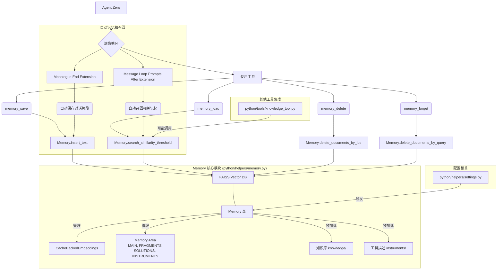

### Memory 功能总结

Agent Zero 的 `memory` 功能是其核心能力之一，允许 Agent 存储、检索、管理和利用过去的经验和信息。它通过一个基于向量数据库的系统实现，使得 Agent 能够拥有“长期记忆”和“短期记忆”。

#### 1. 功能和用途

*   **持久化存储**: `memory` 系统能够存储不同类型的信息，包括：
    *   **用户提供的信息**: 例如，用户的偏好、API 密钥、个人资料等。
    *   **对话片段 (`Fragments`)**: 从过去的对话中提取的关键信息，用于保持对话连贯性和上下文理解。
    *   **解决方案 (`Solutions`)**: Agent 成功解决问题或完成任务的经验和方法，可以在未来遇到类似问题时复用。
    *   **工具 (`Instruments`)**: 工具的描述和使用方法，Agent 可以根据需要调用这些工具。
*   **学习与适应**: 通过对存储的记忆进行检索和分析，Agent 能够从过去的交互中学习，并调整其行为和决策过程。
*   **知识管理**: 记忆被分类到不同的“区域”（`MAIN`, `FRAGMENTS`, `SOLUTIONS`, `INSTRUMENTS`），并通过元数据进行丰富，这使得记忆的组织和精确检索成为可能。
*   **上下文感知**: Agent 可以根据当前任务或对话内容，加载相关的记忆，从而在决策时拥有更丰富的上下文信息。

#### 2. 核心模块与工具

`memory` 功能主要围绕 `python/helpers/memory.py` 中的 `Memory` 类和 `python/tools/` 目录下的四个专用工具展开：

*   **`python/helpers/memory.py` (`Memory` 类)**:
    *   **核心**: 负责抽象底层向量数据库（FAISS）的交互。它管理记忆的初始化、加载、保存和持久化。
    *   **嵌入模型**: 使用 `CacheBackedEmbeddings` 来高效处理文本嵌入，并将嵌入缓存到文件系统 (`memory/embeddings/`)。
    *   **记忆区域**: 定义了 `Memory.Area` 枚举，用于对记忆进行分类，如 `MAIN`, `FRAGMENTS`, `SOLUTIONS`, `INSTRUMENTS`。
    *   **知识预加载**: 在初始化时，可以从 `knowledge/` 目录预加载知识文档和 `instruments/` 目录下的工具描述，这些文档会被嵌入并存储到记忆中。
    *   **API**: 提供 `insert_text`, `insert_documents`, `search_similarity_threshold`, `delete_documents_by_query`, `delete_documents_by_ids` 等方法，供上层工具和模块调用。

*   **`python/tools/memory_save.py` (`MemorySave` 工具)**:
    *   **用途**: 允许 Agent 将文本信息保存到记忆中。
    *   **使用场景**: 当 Agent 遇到重要的新信息、学到新的知识、或者需要持久化存储特定数据时，它会使用 `memory_save` 将这些信息添加到其长期记忆中。例如，用户提供的个人信息、关键的对话摘要、或任务执行中产生的有价值的中间结果。
    *   **调用位置**: 主要在 Agent 的 `prompts` 中被定义为可用的工具，由 Agent 根据其决策逻辑选择性调用。

*   **`python/tools/memory_load.py` (`MemoryLoad` 工具)**:
    *   **用途**: 允许 Agent 根据查询条件从记忆中检索相关信息。
    *   **使用场景**: 当 Agent 需要回忆过去的对话、查找特定知识、或者获取与当前任务相关的数据时，它会使用 `memory_load`。例如，在回答用户问题前，Agent 会尝试加载与问题相关的历史记忆；在执行复杂任务时，Agent 会加载相关的解决方案或工具使用说明。
    *   **调用位置**:
        *   主要在 Agent 的 `prompts` 中被定义为可用的工具。
        *   在 `python/tools/knowledge_tool._py` 和 `python/tools/memory_forget.py` 中，其 `DEFAULT_THRESHOLD` 被导入，这表明其他工具在内部逻辑中可能依赖 `memory_load` 的相似性评估机制。尤其是在 `knowledge_tool` 中，它可能用于内部的知识检索。
        *   `python/extensions/message_loop_prompts_after/_50_recall_memories.py` 中会主动调用 `db.search_similarity_threshold` 来回忆记忆，这与 `memory_load` 的核心功能直接相关。

*   **`python/tools/memory_delete.py` (`MemoryDelete` 工具)**:
    *   **用途**: 允许 Agent 根据记忆的唯一 ID 精确删除记忆。
    *   **使用场景**: 当 Agent 需要清理不再需要的特定记忆时使用。这通常发生在记忆变得过时、错误、或需要被手动移除以满足隐私或管理要求时。例如，用户明确要求删除某个特定信息。
    *   **调用位置**: 主要在 Agent 的 `prompts` 中被定义为可用的工具。

*   **`python/tools/memory_forget.py` (`MemoryForget` 工具)**:
    *   **用途**: 允许 Agent 根据查询条件和相似度阈值批量删除记忆，实现“遗忘”某个主题相关的所有记忆。
    *   **使用场景**: 当 Agent 需要清除某个主题的全部相关记忆，例如用户不希望 Agent 再提及某个特定话题，或者某个知识领域变得完全不相关时。
    *   **调用位置**: 主要在 Agent 的 `prompts` 中被定义为可用的工具。

#### 3. 代码中的调用位置（Beyond direct tool calls）

除了在 `prompts` 中作为可调用工具的定义外，`memory` 功能的核心逻辑还在以下 Python 文件中被更深层次地集成和调用：

*   **`python/extensions/monologue_end/_50_memorize_fragments.py`**:
    *   **用途**: 这个扩展负责在 Agent 的独白结束时，自动提取对话片段并将其保存到记忆中。
    *   **调用**: 它会调用 `Memory` 实例的 `insert_documents` 方法来保存新的片段记忆。它还可能使用 `delete_documents_by_query` 来移除过时的、过于相似的记忆片段，以优化记忆库。
    *   **场景**: 确保 Agent 能够自动学习和维护对话上下文。

*   **`python/extensions/message_loop_prompts_after/_50_recall_memories.py`**:
    *   **用途**: 这个扩展负责在消息循环提示后，自动从记忆中召回与当前对话相关的记忆。
    *   **调用**: 它会调用 `Memory` 实例的 `search_similarity_threshold` 方法来检索相关的 `MAIN` 和 `FRAGMENTS` 区域的记忆，并将这些记忆作为上下文提供给 Agent。
    *   **场景**: 提高 Agent 对当前对话的理解能力和响应的相关性。

*   **`python/helpers/settings.py`**:
    *   **用途**: 在嵌入模型配置发生变化时，负责触发 `Memory` 的重新加载。
    *   **调用**: `from python.helpers.memory import reload as memory_reload` 并调用 `memory_reload()`，这会清除 `Memory.index`，强制在下次 `Memory.get()` 调用时重新初始化向量数据库，以适应新的嵌入模型。
    *   **场景**: 确保记忆系统与当前的嵌入模型兼容，避免因为模型不匹配导致记忆无法正确检索或存储。

*   **`python/tools/knowledge_tool._py`**:
    *   虽然 `search_files` 结果只显示导入了 `DEFAULT_MEMORY_THRESHOLD`，但考虑到 `knowledge_tool` 自身的功能是进行知识搜索，它很可能在内部逻辑中直接或间接调用了 `Memory` 类的 `search_similarity_threshold` 方法来从本地知识库（本质上也是记忆的一部分）中检索信息。需要进一步查看该文件来确认。

#### 4. `prompts` 中 `memory_save` 的具体实现方式及 Agent 的解析和使用

`prompts/default/agent.system.tool.memory.md` 文件本身并没有直接“实现” `memory_save` 的功能，它更像是一个“使用手册”或“接口定义”。它告诉 Agent 在什么情况下应该使用 `memory_save`，以及如何构造调用 `memory_save` 所需的参数。

**`prompts` 中 `memory_save` 的结构示例**:

```json
{
    "thoughts": [
        "I need to memorize...",
    ],
    "headline": "Saving important information to memory",
    "tool_name": "memory_save",
    "tool_args": {
        "text": "# To compress...",
    }
}
```

**Agent 如何解析和使用 `prompts`**:

Agent Zero 的运作机制是基于大型语言模型（LLM）的。LLM 在接收到用户输入、内部状态、以及各种系统提示（包括 `agent.system.tool.memory.md` 这样的工具定义提示）后，会生成一个“思考过程”（`thoughts`）和一个“行动计划”（通常是 JSON 格式的工具调用）。

1.  **Prompt Engineering**: 像 `agent.system.tool.memory.md` 这样的文件就是 Prompt Engineering 的结果。它将可用的工具及其用法以结构化的方式（Markdown 和 JSON 示例）呈现给 LLM。
2.  **LLM 推理**: LLM 在推理过程中，会根据当前任务的目标、对话历史和这些工具提示，判断是否需要使用某个工具，以及如何填充该工具的参数。例如，如果 LLM 判断当前需要保存某些重要信息，它就会生成一个包含 `tool_name: "memory_save"` 和相应 `tool_args` 的 JSON 结构。
3.  **工具执行**: Agent Zero 的核心框架会解析 LLM 生成的 JSON 响应，识别出 `tool_name`，然后调用对应的 Python 工具（例如 `python/tools/memory_save.py` 中定义的 `MemorySave` 类）并传递 `tool_args`。

因此，`prompts` 并不是 `memory_save` 的直接代码实现，而是指导 Agent LLM 如何“使用”这些已实现工具的“元指令”。

**总结图示 (Mermaid Diagram)**:

