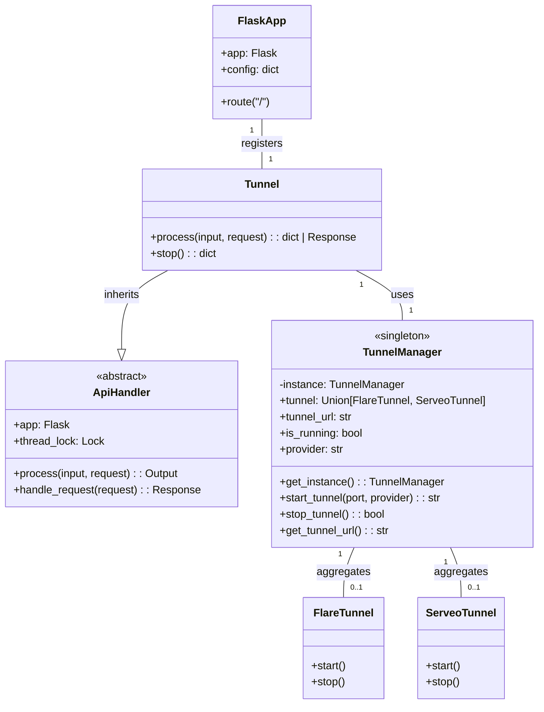
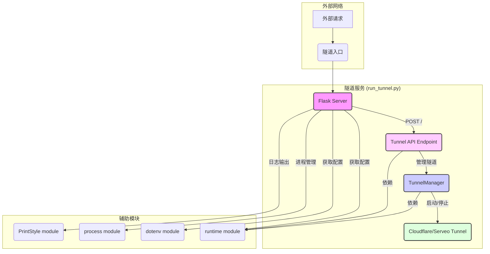

# `run_tunnel.py` 架构分析报告

## 概述
`run_tunnel.py` 是 Agent Zero 项目中一个独立的后端入口文件，专门用于管理和提供隧道服务。它通过 Flask 框架运行一个轻量级服务器，暴露一个 API 端点来处理隧道的创建、停止和状态查询等操作。

## 核心职责
-   **独立的 Flask 应用**: 启动一个独立的 Flask 实例，与主 Web UI 服务分离。
-   **隧道 API 端点**: 暴露一个 POST 请求路由 `/`，用于接收隧道相关的操作请求。
-   **隧道管理**: 通过 `python.api.tunnel.Tunnel` 和 `python.helpers.tunnel_manager.TunnelManager` 管理实际的隧道连接（如 Cloudflare Tunnel 或 Serveo Tunnel）。
-   **服务器管理**: 使用 Werkzeug 的 `make_server` 启动 HTTP 服务器。

## 核心类图

## 架构图

## 依赖项分析
### Python 标准库与第三方库
-   `threading`: 用于在单独线程中运行隧道以避免阻塞。
-   `flask`: Web 框架核心。
-   `werkzeug`: 提供 WSGI 工具，用于服务器创建。
-   `flaredantic`: 用于创建 Cloudflare 和 Serveo 隧道的第三方库。

### Agent Zero 内部模块
-   `python.api.tunnel.py` (`Tunnel`): 实际处理隧道 API 请求的类，继承自 `ApiHandler`。
-   `python.helpers.tunnel_manager.py` (`TunnelManager`): 负责隧道的生命周期管理，包括启动、停止和获取状态。它是一个单例类，确保隧道管理的唯一性。
-   `python.helpers.runtime`: 提供运行时配置，如获取 Web UI 端口。
-   `python.helpers.dotenv`: 用于加载环境变量。
-   `python.helpers.process`: 用于进程管理。
-   `python.helpers.print_style`: 用于控制台输出。

## 总结
`run_tunnel.py` 作为一个独立的微服务，专注于提供稳定的隧道连接。其设计简洁，通过 `Tunnel` 和 `TunnelManager` 类封装了复杂的隧道逻辑，并通过 Flask 暴露必要的 API，确保了隧道服务的独立性和可管理性。