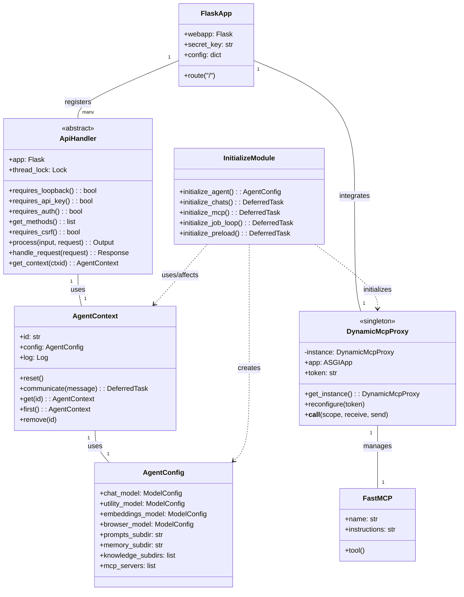
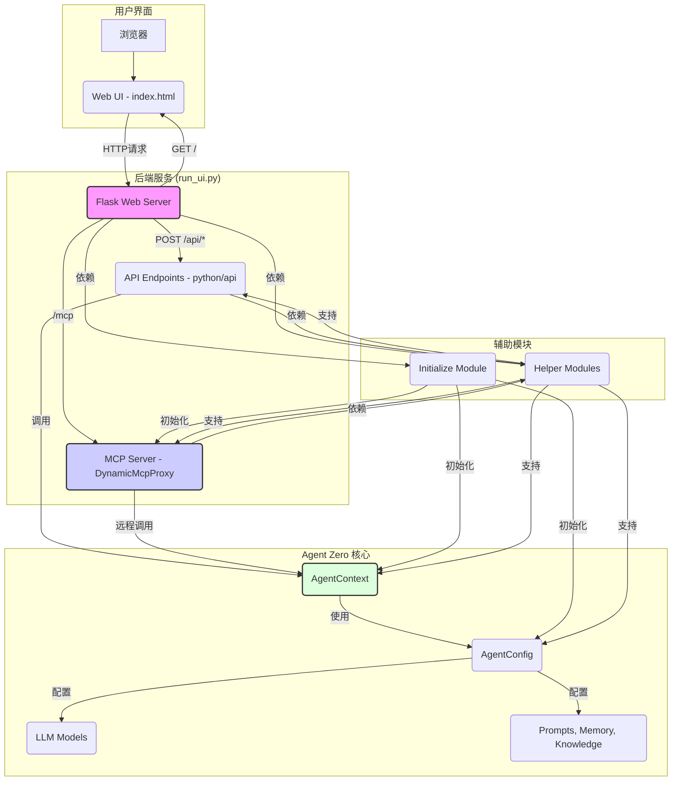

# `run_ui.py` 架构分析报告

## 概述
`run_ui.py` 是 Agent Zero 项目中主要的后端应用程序入口文件。它基于 Flask 框架构建，负责启动 Web UI、提供 RESTful API 服务，并集成 MCP（Master Control Program）服务。该文件还负责初始化 Agent Zero 的核心组件。

## 核心职责
-   **Flask Web 应用初始化**: 创建并配置 Flask 应用程序实例。
-   **Web UI 服务**: 处理根路径请求，提供 `webui/index.html` 文件作为前端界面。
-   **RESTful API 服务**: 动态加载 `python/api` 目录下的所有 `ApiHandler` 类，并将其注册为 API 端点，处理客户端请求。
-   **MCP 服务集成**: 通过 Werkzeug 的 `DispatcherMiddleware` 将 MCP 服务的流量路由到 `DynamicMcpProxy`。
-   **Agent Zero 核心组件初始化**: 调用 `initialize.py` 中的函数，初始化 Agent 的聊天上下文、MCP 配置、任务调度循环和预加载模块。
-   **认证与安全**: 实现 API Key 认证、基本认证、环回地址限制和 CSRF 保护。
-   **服务器管理**: 使用 Werkzeug 的 `make_server` 启动并管理 HTTP 服务器。

## 核心类图

## 架构图

## 依赖项分析
### Python 标准库与第三方库
-   `datetime`, `os`, `secrets`, `sys`, `time`, `socket`, `struct`, `functools`, `threading`, `signal`, `typing`: Python 内置库，用于基础操作。
-   `flask`: Web 框架核心。
-   `flask_basicauth`: 提供基础 HTTP 认证功能。
-   `werkzeug`: 提供 WSGI 工具，用于服务器创建和中间件。
-   `a2wsgi`: ASGI/WSGI 适配器。

### Agent Zero 内部模块
-   `initialize.py`: 包含 `initialize_agent`、`initialize_chats`、`initialize_mcp`、`initialize_job_loop`、`initialize_preload` 等函数，负责 Agent Zero 核心组件的初始化和配置。
-   `python.helpers.api.py` (`ApiHandler`): 所有 API 端点的基类，定义了 API 的通用处理逻辑和认证要求。它通过 `get_context` 方法与 `AgentContext` 实例连接。
-   `python.helpers.mcp_server.py` (`DynamicMcpProxy`, `FastMCP`): 负责 MCP 服务的启动、配置和管理。`DynamicMcpProxy` 作为一个单例，封装了 FastMCP 实例并提供动态配置能力。
-   `python.helpers` 下的其他模块（如 `errors`、`files`、`git`、`runtime`、`dotenv`、`process`、`extract_tools`、`print_style` 等）：这些模块提供了各种辅助功能，被 `run_ui.py` 直接或间接调用。例如，`extract_tools.load_classes_from_folder` 用于动态加载 `python/api` 目录下的 API 处理程序。
-   `python.api` 目录下的所有模块：这些模块（如 `backup_create.py`、`chat_export.py` 等）是具体的 API 端点实现，它们都继承自 `ApiHandler`，并由 `run_ui.py` 动态加载。

## 总结
`run_ui.py` 作为 Agent Zero 的核心后端，通过 Flask 提供了 Web UI 和 REST API 服务。其设计通过动态加载 API 模块和集成 MCP 服务实现了高度的模块化和扩展性。`initialize.py` 负责 Agent 核心组件的生命周期管理，而 `ApiHandler` 和 `DynamicMcpProxy` 则分别抽象了 API 处理和 MCP 服务集成的通用模式。