# `webui/index.html` 架构分析报告

## 概述
`webui/index.html` 是 Agent Zero 项目的前端主要入口文件，负责构建用户界面并集成各种客户端功能。它通过引入 CSS 文件来定义样式，通过 JavaScript 文件实现交互逻辑和第三方库功能，并通过组件化方式集成可复用的 HTML 片段。

## 核心职责
-   **页面结构**: 提供 Web UI 的基本 HTML 骨架和布局。
-   **样式集成**: 引入项目自定义 CSS 文件和第三方 CSS 库，定义界面外观。
-   **脚本集成**: 引入项目自定义 JavaScript 文件和第三方 JS 库，实现交互功能。
-   **数据绑定与事件处理**: 利用 Alpine.js 框架实现响应式 UI 和事件处理。
-   **组件化**: 通过自定义的 `x-component` 标签（或类似机制）嵌入可复用的 UI 模块。

## 架构图

```mermaid
graph TD
    subgraph 浏览器
        A[index.html]
    end

    subgraph 样式层
        B[index.css]
        C[css/messages.css]
        D[css/toast.css]
        E[css/settings.css]
        F[css/file_browser.css]
        G[css/modals.css]
        H[css/modals2.css]
        I[css/speech.css]
        J[css/history.css]
        K[css/scheduler-datepicker.css]
        L[css/tunnel.css]
        M[vendor/font-awesome/all.min.css]
        N[vendor/flatpickr/flatpickr.min.css]
        O[vendor/katex/katex.min.css]
        P[vendor/google/google-icons.css]
        Q[vendor/ace/ace.min.css]
    end

    subgraph "功能层JavaScript"
        R[Alpine.js]
        S[js/scheduler.js]
        T[js/history.js]
        U[index.js]
        V[js/initFw.js]
        W[js/tunnel.js]
        X[js/settings.js]
        Y[js/file_browser.js]
        Z[js/modal.js]
        AA[vendor/flatpickr/flatpickr.min.js]
        BB[vendor/ace/ace.js]
        CC[vendor/katex/katex.min.js]
        DD[vendor/katex/katex.auto-render.min.js]
    end

    subgraph 组件
        EE[chat/attachments/inputPreview.html]
        FF[chat/attachments/dragDropOverlay.html]
    end

    %% 样式引入关系
    A --> B
    A --> C
    A --> D
    A --> E
    A --> F
    A --> G
    A --> H
    A --> I
    A --> J
    A --> K
    A --> L
    A --> M
    A --> N
    A --> O
    A --> P
    A --> Q

    %% 脚本引入关系
    A --> R
    A --> S
    A --> T
    A --> U
    A --> V
    A --> W
    A --> X
    A --> Y
    A --> Z
    A --> AA
    A --> BB
    A --> CC
    A --> DD

    %% 组件集成
    A --> EE
    A --> FF

    %% JavaScript依赖关系
    S --> R
    T --> R
    U --> R
    V --> R
    W --> R
    X --> R
    Y --> R
    Z --> R

    %% 特定依赖
    S --> AA
    T --> X
    U --> X
    U --> Y
    U --> Z
    U --> W
    U --> S
    U --> T
    V --> R
    V --> X
    V --> Y
    V --> Z
    V --> W
    V --> S
    V --> T

    %% 样式设置
    style A fill:#f9f,stroke:#333,stroke-width:2px
    style R fill:#add8e6,stroke:#333,stroke-width:2px
```

## 依赖项分析
### CSS 文件
-   **核心样式**: `index.css` 定义了全局和主要布局样式。
-   **模块化样式**: `css/messages.css`, `css/toast.css`, `css/settings.css`, `css/file_browser.css`, `css/modals.css`, `css/modals2.css`, `css/speech.css`, `css/history.css`, `css/scheduler-datepicker.css`, `css/tunnel.css` 分别负责特定功能模块的样式。
-   **第三方样式**: `vendor/font-awesome/all.min.css` (图标), `vendor/flatpickr/flatpickr.min.css` (日期选择器), `vendor/katex/katex.min.css` (数学公式), `vendor/google/google-icons.css` (图标), `vendor/ace/ace.min.css` (代码编辑器主题)。

### JavaScript 文件
-   **第三方库**:
    -   `vendor/flatpickr/flatpickr.min.js`: 日期/时间选择器。
    -   `vendor/alpine/alpine.collapse.min.js`: Alpine.js 的折叠插件。
    -   `vendor/ace/ace.js`: 代码编辑器。
    -   `vendor/katex/katex.min.js`, `vendor/katex/katex.auto-render.min.js`: KaTeX 数学公式渲染库。
-   **核心模块**:
    -   `index.js`: 主 JavaScript 文件，可能包含全局初始化和核心逻辑。
    -   `js/initFw.js`: 框架初始化相关的逻辑。
-   **功能模块**:
    -   `js/scheduler.js`: 任务调度器相关的 JavaScript 逻辑。
    -   `js/history.js`: 聊天历史记录相关的逻辑。
    -   `js/tunnel.js`: 隧道功能相关的逻辑。
    -   `js/settings.js`: 设置页面相关的逻辑。
    -   `js/file_browser.js`: 文件浏览器相关的逻辑。
    -   `js/modal.js`: 通用模态框组件的逻辑。

### 组件化
-   `chat/attachments/inputPreview.html` 和 `chat/attachments/dragDropOverlay.html`：这些是 HTML 片段，通过 `x-component` 标签嵌入到 `index.html` 中，用于实现附件预览和拖放上传功能。这表明项目采用了一种客户端侧的组件化方法。

## 总结
`webui/index.html` 构建了一个功能丰富且模块化的前端界面。它利用 Alpine.js 实现了轻量级的响应式交互，通过分离的 CSS 和 JavaScript 文件实现了样式和逻辑的分离，并通过引入第三方库提供了强大的功能（如日期选择、代码编辑、数学公式渲染等）。组件化的使用进一步提高了代码的可维护性和复用性。