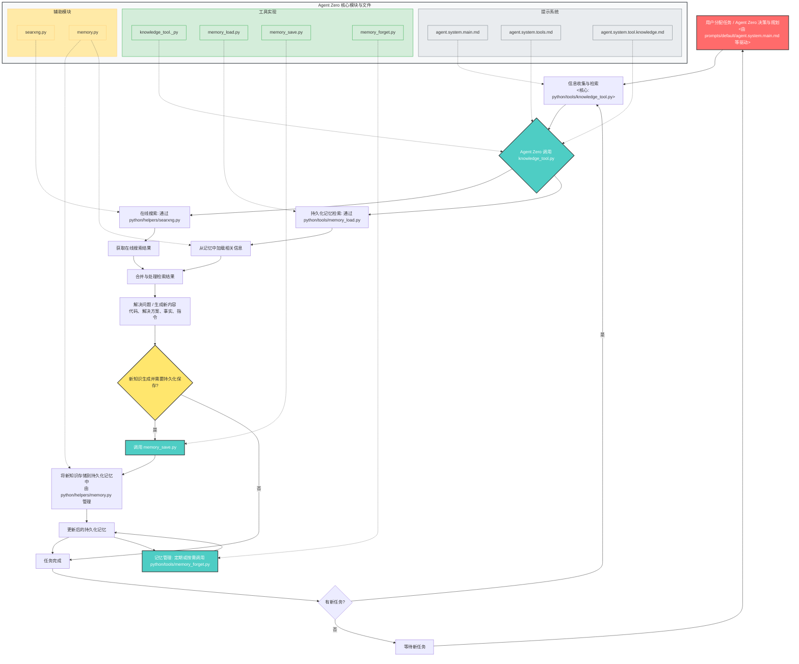

# Agent Zero 动态学习与成长分析报告

Agent Zero 的核心价值之一在于其“动态学习与成长”的能力，这使其能够脱离预设的固定功能，通过与用户的交互和任务的执行不断积累经验，提升解决问题的效率和可靠性。这一能力的实现主要依赖于其强大的记忆（Memory）和知识（Knowledge）管理系统，并通过工具调用和系统提示进行驱动。

以下是“动态学习与成长”的详细实现细节，并配以 Mermaid 流程图说明：

**实现细节说明：**

Agent Zero 的核心价值之一在于其“动态学习与成长”的能力，这使其能够脱离预设的固定功能，通过与用户的交互和任务的执行不断积累经验，提升解决问题的效率和可靠性。这一能力的实现主要依赖于其强大的记忆（Memory）和知识（Knowledge）管理系统，并通过工具调用和系统提示进行驱动。

**1. 信息摄取与检索 (Information Ingestion & Retrieval)**

当用户向 Agent Zero 分配任务，或 Agent Zero 独立进行决策和规划（图中的 `A`）时，它首先需要收集和检索相关信息（图中的 `B`）。这一过程的核心是 [`knowledge_tool._py`](python/tools/knowledge_tool._py)（图中的 `T1`）。

*   **[`knowledge_tool._py`](python/tools/knowledge_tool._py) 的作用**：作为 Agent Zero 获取外部和内部知识的统一入口（图中的 `C`），它能够同时进行在线搜索（图中的 `D1`）和内部记忆检索（图中的 `D2`），确保 Agent Zero 能够获取到最全面和最新的信息。
*   **在线搜索 (SearXNG)**：[`knowledge_tool._py`](python/tools/knowledge_tool._py) 通过调用 [`python/helpers/searxng.py`](python/helpers/searxng.py)（图中的 `H1`）实现对外部网络的搜索。这使得 Agent Zero 能够访问互联网上的实时信息，弥补内部知识的不足（图中的 `E1`）。
*   **持久化记忆 (Memory)**：同时，[`knowledge_tool._py`](python/tools/knowledge_tool._py) 会利用 [`python/tools/memory_load.py`](python/tools/memory_load.py)（图中的 `T2`）从 Agent Zero 的内部记忆库中检索信息。内部记忆库存储了 Agent Zero 过去学到的解决方案、代码、事实和指令，这对于快速解决重复性问题至关重要（图中的 `E2`）。
    *   [`memory_load.py`](python/tools/memory_load.py) 负责根据查询的相似度从向量数据库中加载相关记忆。
*   **提示驱动 (Prompts)**：Agent Zero 如何判断何时以及如何使用 `knowledge_tool` 呢？这主要由 [`prompts/default/agent.system.main.md`](prompts/default/agent.system.main.md)（图中的 `P1`）、[`prompts/default/agent.system.tools.md`](prompts/default/agent.system.tools.md)（图中的 `P2`）和 [`prompts/default/agent.system.tool.knowledge.md`](prompts/default/agent.system.tool.knowledge.md)（图中的 `P3`）等系统提示来指导。这些提示不仅定义了 `knowledge_tool` 的功能，还提供了使用示例和策略，例如“优先查询结果而非寻求指导”、“通过在线信息验证记忆”等，确保 Agent Zero 能高效地利用该工具。

**2. 知识的形成与存储 (Knowledge Formation & Storage)**

在 Agent Zero 处理检索到的信息（图中的 `F`），并解决问题或执行任务（图中的 `G`）的过程中，可能会产生新的知识（图中的 `H`），例如一个新问题的解决方案、一段可复用的代码、一个重要的事实或用户明确给出的新指令。这些新知识是 Agent Zero “成长”的关键，它们需要被持久化存储起来。

*   **[`memory_save.py`](python/tools/memory_save.py) 的作用**：负责将 Agent Zero 在任务执行过程中产生的有价值信息保存到其持久化记忆中（图中的 `I`）。
*   **记忆区域与元数据**：[`memory_save.py`](python/tools/memory_save.py) 允许为保存的记忆指定 `area`（例如，主记忆、解决方案等）和 `metadata`。这使得记忆可以被结构化存储，便于未来更精确的检索。
*   **Memory 模块**：实际的记忆操作由 [`python/helpers/memory.py`](python/helpers/memory.py)（图中的 `H2`）中的 `Memory` 模块处理，它抽象了底层向量数据库的交互细节（图中的 `J`），最终更新持久化记忆（图中的 `K`）。

**3. 记忆管理与优化 (Memory Management & Optimization)**

为了确保记忆库的效率和相关性，Agent Zero 还需要进行记忆管理，包括遗忘（删除）不再需要或过时的信息。这是“动态学习”不可或缺的一部分，因为它防止了记忆库变得臃肿和充满噪音。

*   **[`memory_forget.py`](python/tools/memory_forget.py) 的作用**：允许 Agent Zero 根据特定的查询和相似度阈值，删除记忆库中匹配的文档（图中的 `M`，调用 `T4`）。
*   **维护记忆质量**：通过定期的记忆清理或在发现信息过时时主动“遗忘”，Agent Zero 可以保持其记忆库的“新鲜度”和实用性，确保在未来任务中检索到的信息始终是高质量和相关的。

**4. 迭代与进化 (Iteration & Evolution)**

Agent Zero 的动态学习是一个持续的循环。每次任务的执行，无论成功与否，都可能成为其记忆和知识库更新的机会。

*   **反馈循环**：当 Agent Zero 在未来遇到类似的问题时（图中的 `L`），它会首先通过 `knowledge_tool` 检索其更新后的记忆（回到 `B`）。如果记忆中包含相关且有效的解决方案，它将能够更快、更可靠地完成任务，从而展现出“成长”。
*   **系统提示的引导**：[`prompts/default/agent.system.main.md`](prompts/default/agent.system.main.md) 及其包含的子提示（如关于解决问题、角色和通信的提示）共同指导 Agent Zero 学习、适应并优化其行为，使其随着时间的推移变得越来越智能和高效。

**总结**

Agent Zero 的“动态学习与成长”并非通过硬编码的机器学习模型实现，而是通过一个巧妙设计的工具和提示系统驱动的闭环。它能够主动获取、存储、检索和管理知识，并根据这些知识调整其行为。这种机制使得 Agent Zero 成为一个真正能够随着使用而不断进步的个人智能代理。