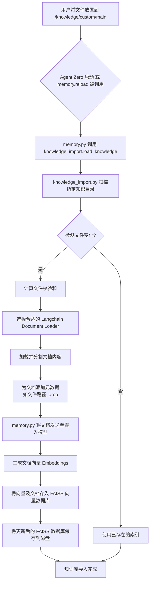
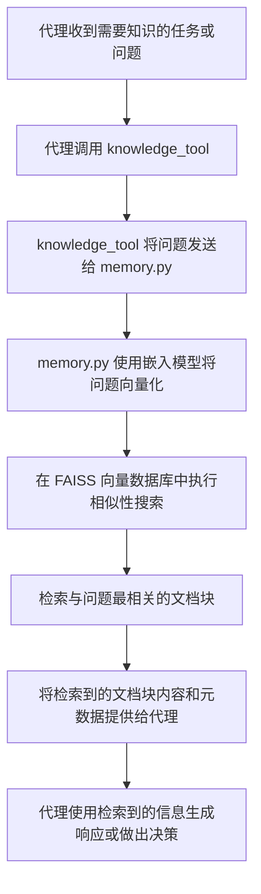

## Agent Zero 知识库配置与使用指南

本指南详细阐述了 Agent Zero 知识库的配置、使用原理及其内部实现流程。

### 1. 知识库概述

Agent Zero 的知识库是一个核心组件，旨在让代理能够从用户提供的结构化和非结构化数据中学习和检索信息。它通过将外部知识集成到代理的工作流中，增强了代理的理解、推理和响应能力，尤其在 RAG (Retrieval-Augmented Generation) 任务中发挥关键作用。

知识库与 Agent Zero 的内存系统紧密相连，是其持久化记忆的一部分。

### 2. 知识库结构与存储

知识库文件存储在 `/knowledge` 目录下，并可进一步细分为不同的子目录以进行组织。
*   **默认知识 (`/knowledge/default`)**: 包含框架预设的知识，例如 `/docs` 文件夹的内容会自动导入。
*   **自定义知识 (`/knowledge/custom/main`)**: 这是用户添加自定义知识的主要位置。
    *   **文件路径**: `knowledge/custom/main/`
    *   **支持的文件格式**:
        *   纯文本文件 (`.txt`)
        *   PDF 文档 (`.pdf`)
        *   CSV 文件 (`.csv`)
        *   HTML 文件 (`.html`)
        *   JSON 文件 (`.json`) - 作为纯文本处理
        *   Markdown 文件 (`.md`) - 作为纯文本处理

**配置要点**:
在 [`python/helpers/settings.py`](python/helpers/settings.py:1033) 中，`agent_knowledge_subdir` 字段定义了代理用于导入知识的子目录，默认设置为 `custom`。

### 3. 知识导入机制与原理

知识导入是一个自动化的过程，涉及到文件的加载、校验、分割、向量化和索引。

#### 流程图：知识导入 (Mermaid)

#### 原理说明:

1.  **文件监控**: Agent Zero 会监控配置的知识目录（如 `/knowledge/custom/main`）中的文件。
2.  **内容校验**: `python/helpers/knowledge_import.py` 会为每个文件生成一个 MD5 校验和。通过比较文件的校验和，系统可以判断文件是否被修改，从而避免重复处理未更改的文件。
3.  **文档加载与分割**:
    *   对于新增或修改的文件，`knowledge_import.py` 使用 `langchain_community.document_loaders` 库来加载文件内容。
    *   大型文档会被自动分割成更小的“文档块”（documents），以适应模型的上下文窗口限制，并提高检索的粒度。
4.  **元数据附加**: 每个文档块都会附带元数据，如文件路径、内容来源和所属的知识区域（`main`、`solutions`、`fragments` 等）。
5.  **向量化**: `python/helpers/memory.py` 使用配置的嵌入模型（如 `sentence-transformers/all-MiniLM-L6-v2`）将每个文档块的内容转换为高维向量（embeddings）。
6.  **向量数据库索引**: 这些向量随后被存储到 `FAISS` (Facebook AI Similarity Search) 向量数据库中。FAISS 是一种高效的相似性搜索库，能够快速查找与查询向量最相似的文档向量。
7.  **持久化**: 索引后的 FAISS 数据库会保存到磁盘上（在 `/memory` 目录的子目录中），以便下次启动时快速加载，而无需重新处理所有原始文件。

### 4. 知识检索与应用

代理通过 `knowledge_tool` 来利用知识库中的信息。

#### 流程图：知识检索 (Mermaid)

#### 原理说明:

1.  **`knowledge_tool`**: 这不是一个独立的 Python 文件，而是一个在代理系统提示中定义的逻辑工具。当代理需要外部知识时，它会触发对 `knowledge_tool` 的调用。
2.  **相似性搜索**: 当 `knowledge_tool` 被激活时，它实际上会调用 `python/helpers/memory.py` 中 `Memory` 类的 `search_similarity_threshold` 方法。
3.  **查询向量化**: 用户的查询（或代理的问题）会被嵌入模型转换为向量。
4.  **高效检索**: `memory.py` 使用这个查询向量在 `FAISS` 数据库中执行相似性搜索，快速找到与查询内容语义最相关的文档块。
5.  **结果返回**: 最相关的文档块（通常包含原始文本和元数据）会被返回给代理。
6.  **代理决策**: 代理利用这些检索到的信息来增强其理解，从而生成更准确、更丰富的响应，或在决策过程中提供依据。

### 5. 知识库配置总结

为了有效配置和使用 Agent Zero 的知识库，用户需要关注以下几点：

1.  **放置知识文件**: 将支持的文件类型（`.txt`、`.pdf`、`.csv`、`.html`、`.json`、`.md`）手动放置到 `knowledge/custom/main/` 目录下。
2.  **理解自动导入**: 文件一旦放置，Agent Zero 会在启动时或通过 API 触发时自动检测并导入它们。
3.  **配置嵌入模型**: 确保 `python/helpers/settings.py` 中 `embed_model_provider` 和 `embed_model_name` 配置正确，因为它们影响知识的向量化和检索质量。
4.  **API 导入 (可选)**: 如果需要通过 UI 或程序化方式导入文件，可以使用 `python/api/import_knowledge.py` 提供的 API 端点。
5.  **利用 `knowledge_tool`**: 代理会自动调用 `knowledge_tool` 来检索知识，用户无需直接干预其内部实现。

通过理解这些配置和原理，用户可以高效地管理和利用 Agent Zero 的知识库，从而提升代理在各种任务中的表现。