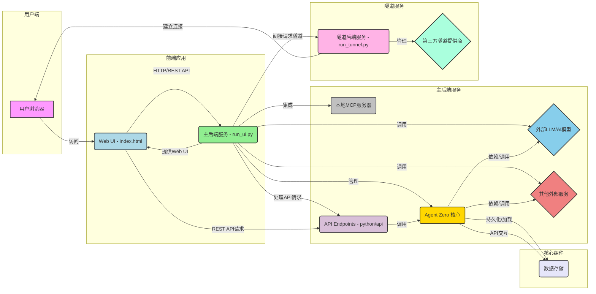

# 项目整体架构分析

## 概述
Agent Zero 项目的架构围绕一个核心后端服务（由 `run_ui.py` 提供）和一个独立存在的隧道服务（由 `run_tunnel.py` 提供）构建，并通过一个现代化的 Web UI 提供用户交互。整个系统旨在实现模块化和可扩展性，Agent Zero 核心逻辑与外部服务（如 LLM、第三方隧道）紧密集成。

## 主要入口文件及其职责
1.  **`run_ui.py` (主后端服务)**:
    *   **核心功能**: 启动 Flask Web 服务器，作为主要的后端入口。
    *   **Web UI 提供**: 服务 `webui/index.html`，提供前端用户界面。
    *   **API Gateway**: 动态加载并注册 `python/api/` 目录下的所有 API 处理程序，提供 RESTful API 服务。
    *   **Agent Zero 核心管理**: 负责初始化 Agent 的核心组件（聊天上下文、任务调度、内存管理等）。
    *   **MCP 服务集成**: 集成 Master Control Program (MCP) 服务器，支持远程 Agent 通信。

2.  **`run_tunnel.py` (隧道后端服务)**:
    *   **核心功能**: 启动一个独立的 Flask 服务器，专门用于管理和提供隧道服务。
    *   **隧道管理**: 通过 `TunnelManager` 抽象层，与第三方隧道提供商（如 Cloudflare 或 Serveo）交互，建立安全的外部访问通道。

3.  **`webui/index.html` (前端应用)**:
    *   **核心功能**: 项目的前端入口点，提供用户交互界面。
    *   **技术栈**: 主要使用 HTML、CSS 和 JavaScript (配合 Alpine.js) 构建动态和响应式的用户界面。
    *   **与后端通信**: 通过 HTTP/REST API 请求与 `run_ui.py` 提供的后端服务进行交互。

4.  **`python/api/*.py` (API 端点)**:
    *   **核心功能**: 位于 `python/api/` 目录下的每个 Python 文件都代表一个特定的 RESTful API 端点。
    *   **动态加载**: 这些 API 由 `run_ui.py` 动态加载并注册到 Flask 应用程序中。
    *   **功能模块**: 涵盖了聊天管理、文件操作、系统设置、任务调度、备份恢复、语音合成/识别等多种功能。

## 整体架构图

## 交互流程
1.  **用户访问**: 用户通过浏览器访问 Agent Zero 的 Web UI (`index.html`)。
2.  **前端与主后端通信**:
    *   Web UI 向 `run_ui.py` 发送 HTTP 请求，获取初始页面和静态资源。
    *   用户在 UI 上的操作（如发送消息、管理文件、更改设置）会触发 Web UI 向 `run_ui.py` 提供的 RESTful API 端点 (`python/api/*`) 发送请求。
3.  **主后端业务处理**:
    *   `run_ui.py` 接收到 API 请求后，根据请求路由到相应的 `ApiHandler`。
    *   `ApiHandler` 与 `Agent Zero 核心` 交互，执行业务逻辑，如调用 LLM 模型、管理数据、执行任务等。
    *   `Agent Zero 核心` 可能依赖 `数据存储` 进行持久化操作。
4.  **MCP 通信**: `run_ui.py` 中集成的本地 MCP 服务器允许其他远程 Agent Zero 实例通过 MCP 协议进行通信，实现Agent间的协作。
5.  **隧道服务**: 如果用户需要从外部网络访问其本地 Agent Zero 实例，Web UI 可以通过 `run_ui.py` （间接）触发 `run_tunnel.py` 启动隧道服务。`run_tunnel.py` 会与 `第三方隧道提供商` 交互，建立公共可访问的 URL。
6.  **Agent Zero 核心与外部服务**: `Agent Zero 核心` 会根据任务需求，调用 `外部 LLM/AI 模型`（如 GPT-4、Claude 等）以及 `其他外部服务`（如搜索引擎、工具 API 等）来完成复杂任务。

## 总结
Agent Zero 的架构是一个典型的客户端-服务器模型，后端服务进一步划分为主业务逻辑和独立的辅助服务（隧道）。核心的 Agent Zero 逻辑被封装在 `Agent Zero 核心` 中，并通过标准化的 API 接口暴露给前端。这种设计允许不同组件独立开发和部署，提高了系统的可维护性、可扩展性和弹性。